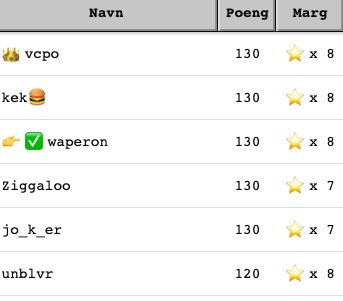
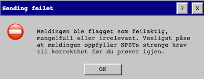
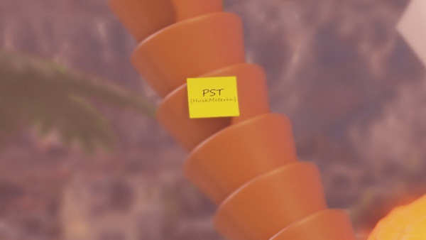
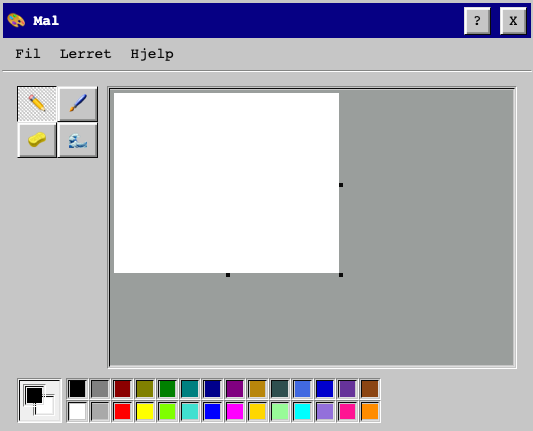
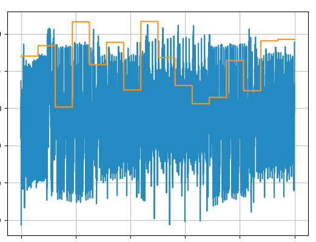
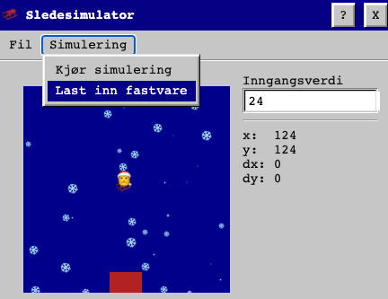
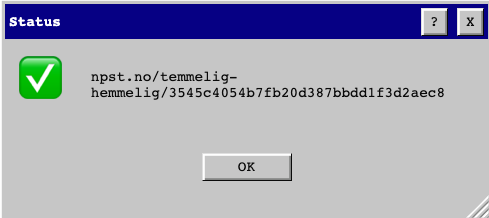

# Intro
For andre året på rad arrangerte [PST](https://pst.no/) en [CTF](https://en.wikipedia.org/wiki/Capture_the_flag) der man under tiden fra 1. til 24. desember 2020 skulle løse ulike oppgaver på nett. Som året før, var temaet knyttet opp mot sikkerhetstjenester på Nordpolen og Sydpolen samt noen skumle pingviner som forsøkte å gjøre livet surt for julenissen og hans reinsdyr. Heller obskurt tema, men ganske så underholdende. Hver dag fikk man en ny oppgave i form av en e-post fra brukeren `Mellomleder` i et eget e-post grensesnitt, `Snabel-A`, på nettstedet [dass.npst.no](https://dass.npst.no/). Svaret på oppgaven ville være et _flagg_ som ga 10 poeng.

> Poenggivende flagg er på formen `PST{.*}`, eksempelvis `PST{littTekstOgTall}`.

> Flagg leveres i `Snabel-A` som svar til `Mellomleder` på dagens oppgave.

Det kom også frem etterhvert at det fantes ekstraoppgaver i årets kalender som lå skjult litt rundt omkring som [easter eggs](https://en.wikipedia.org/wiki/Easter_egg_(media)). Ved å finne disse eggene, fikk man en ekstra stjerne i margen på resultatlisten som ble kontinuerlig oppdatert. Med fasit i hånd, var det totalt 11 egg gjemt litt her og der. Mer om de senere.

Det er veldig mange som er mye bedre enn meg på denne type CTF'er, men det er allikevel utrolig lærerikt å prøve seg på de ulike oppgavene. Allikevel litt frustrerende iblant å se at noen løste oppgaven på under 10 min, mens jeg selv brukte maaange timer. Læringsutbyttet kan uansett ingen ta fra oss som deltok 😊 Jeg kom til slutt i mål med alle oppgavene, selv om luke 24 ble levert en dag for sent. Julaften var litt opptatt med andre ting...

Som året før, var det også dette året en aktiv [Discord-kanal](https://discord.gg/8kvF3aU) med veldig mange fine folk og mange gode (og ofte meget sære) diskusjoner underveis. 

Store takk til mange, spesielt til `Darth Kevin`, `S Claus`, `wat`, `Pzzaroo` og `Tivec` for mer eller mindre åpenbare hint til en n00b underveis. PST fortjener også en stor takk for et særdeles godt gjennomført drama i 24 akter.
## Opptur
Årets opptur var utvilsomt 13. desember da jeg en kort stund var på pallen på rankingen. Hvem skulle tro at en enkel gutt fra landet kunne komme så langt? Livsmålet var oppnådd   


## Nedtur
Oppturer kommer sjelden alene, og oppstår gjerne i par med en real nedtur. Årets største nedtur kom fredag 11. desember da jeg mistet meg selv en kort stund. Det kom en e-post fra HR som var som følger

> For de av dere som befinner dere her på Nordpolen vil vi minne om lønningsgløgg i kveld J
> Grunnet den pågående pandemien kan vi dessverre ikke åpne for tilreisende alvebetjenter på dagens arrangement.

I mine grublerier og naivitet tenkte jeg at her lå det et egg begravet. Assosiasjonen gikk raskt til området [Nordpolen i Oslo](https://no.wikipedia.org/wiki/Nordpolen_(Oslo)). Det måtte jo ha en sammenheng!? Så en sen fredagskveld etter at kroppen var fylt med taco, fant jeg ut at jeg burde lufte meg litt. Jeg forlot gullrekka, kone og barn og syklet avgårde. Ut på ekspedisjon, Nordpolen neste! I min iver hadde jeg glemt det alle polfarere bør passe på, nemlig passende bekledning. Det var en våt og kald polfarer som etterhvert smøg seg ubemerket inn på Nordpolen. Her gjaldt det å ikke vekke oppmerksomhet for å ikke skremme lønningsgløggen. Jeg var jo tross alt ikke velkommen.

Oslos Nordpolen er en plass med butikker, restauranter, trafikklys og juletresalg. Og selvsagt, Nordpolen kiosk. Det syntes ganske åpenbart at dette var stedet for en god lønningsgløgg og snikenede alvebetjenter. I tillegg var jeg kald og våt, så jeg måtte finne et sted med varme og kjærlighet.


Her var det bare å bite tenna sammen og snike seg inn. Vel inne var det lite som tydet på julestemning og lønningsgløgg, men det var nok av mistenkelige typer der. Jeg snoket rundt til de mistenkelige typene sluttet å snakke sammen og i sine stille sinn sikkert tenkte at denne karen burde vi kvitte oss med før nissen kommer. Jeg er en fintfølende person, så jeg enset ganske raskt den endrede stemningen i lokalet og fant ut at jeg burde opptre så normalt som mulig. Det mest naturlige jeg kom på var å spørre om de hadde noen egg? Det ble om mulig enda mer stille i kiosken og uroligheten steg nok et hakk hos de mistenkelige typene. Eller de sydpolare agentene, som jeg nå kalte dem i mitt ikke så veldig stille sinn. Kiosken innehaver (som hadde en nese som så litt ut som et pingvinnebb) kunne nølende fortelle at nei, egg hadde de nok ikke. Men skulle det kanskje være noe annet før jeg gikk. Med trykk på _gikk_. Jeg skjønte at jeg var på sporet av noe, men skjønte også at det var lurest å komme seg ut. Keiserpingvinen hadde jo gitt et kraftig hint om at jeg burde komme meg ut, så jeg grabbet til meg en eske IFA, betalte og gikk ut. 

Om man kan høre lettelsens sukk, så var det den lyden jeg hørte bak meg da jeg gikk ut av fiendens pingvinhule. Jeg hadde unnsluppet, med en pakke IFA som nok hadde ligget der noen år siden inneholdet smakte mer som stein (og dette vet jeg en del om siden jeg spiste en del stein i min barndom). Det var helt tydelig at kiosken var et skalkeskjul for hemmelige operasjoner, for omsetning på IFA-pastiller hadde de ikke.

Men så så jeg det! Rett foran meg var egget! Hoho, at jeg ikke hadde sett det før, men spillet var nok sånn at jeg _først_ måtte innom kiosken for deretter å komme ut i rett vinkel i forhold til plassen og se rett på egget! For et vakkert egg!


Men koden, man trenger en kode, hvor var den? Den var heldigvis ikke langt unna, på stolpen rett bak egget.


Oh lykke! Jeg hadde funnet egget! Jeg var kald, våt og hadde munnen full av steinharde IFA-pastiller, men ingenting spilte noen rolle lenger. Her ventet ære, berømmelse og en stor, feit stjerne i margen. Med hjertet på vei opp i halsen og en stein på kollisjonskurs ned samme vei, fikk jeg sendt avgårde **EGG{249825}** til HR. Svaret kom raskt



Whaat!? Det måtte være noe feil? Hadde jeg bommet på tallene? Desperat forsøkte jeg alle permutasjoner av 249825, men med samme nedslående svar fra HR. Jeg måtte slukøret innrømme at jeg hadde tatt feil. 

Som den snikende alvebetjenten jeg nå var, snek jeg meg hjem igjen og latet som ingenting. Akkurat den strategien var vellykket og jeg gled helt ubemerket inn i familielykken igjen og sa noen velvalgte ord om at Alex Rosén var veldig flink til å synge i Stjernekamp. For andre gang på en times tid sluttet mistenkelige typer å snakke rundt meg og jeg gikk og la meg og gråt meg i søvn.

# Luker

| Odd | Even |
| --- | --- |
| [1 - Cæsarchiffer](#1---cæsarchiffer) | [2 - Lydfil](#2---lydfil) |
| [3 - Steganografi](#3---steganografi) | [4 - SQL](#4---sql) |
| [5 - CSV og UTF-16](#5---csv-og-utf-16) | [6 - SLEDE8, intro](#6---slede8-intro) |
| [7 - Signal](#7---signal) | [8 - ASN.1, del 1](#8---asn1-del-1) |
| [9 - Emojis](#9---emojis) | [10 - SLEDE8, hex til ASCII](#10---slede8-hex-til-ascii) |
| [11 - SQLite og WAL-filer](#11---sqlite-og-wal-filer) | [12 - SLEDE8, reversing](#12---slede8-reversing) |
| [13 - ASCII-art](#13---ascii-art) | [14 - SLEDE8, rekkefølge](#14---slede8-rekkefølge) |
| [15 - Manchester code](#15---manchester-code) | [16 - SLEDE8, sortering](#16---slede8-sortering) |
| [17 - ASN.1, del 2](#17---asn1-del-2) | [18 - SLEDE8, buffer overflow](#18---slede8-buffer-overflow) |
| [19 - Shami's Secret Sharing](#19---shamis-secret-sharing) | [20 - pcap](#20---pcap) |
| [21 - Rule 30](#21---rule-30) | [22 - Side-channel attack](#22---side-channel-attack) |
| [23 - QR-koder](#23---qr-koder) | [24 - Sledesimulator](#24---sledesimulator) |
| [Hilsen fra Julenissen](#hilsen-fra-julenissen) | |

# 1 - Cæsarchiffer
> Kan du bekrefte at du har fått tilgang til systemet? Det gjør du ved å svare på denne meldingen med verifiseringskoden RUV{JgkJqPåGtFgvLwnKilgp}.
> OBS: Jeg mistet verifiseringskoden din i salaten, så mulig du må rette opp i den før du svarer.

Årets første luke var en relativt enkel [Cæsarchiffer](https://no.wikipedia.org/wiki/C%C3%A6sarchiffer). Denne kunne man [skifte 24 steg][1] for å finne løsningen. 

**Løsning: PST{HeiHoNåErDetJulIgjen}**

## Kokt egg
Det viste seg at det var skjult et egg i en fil på [dass](https://dass.npst.no/). Det er alltid kjekt å ta en titt på `robots.txt` og [andre relevante filer](https://en.wikipedia.org/wiki/Robots_exclusion_standard). Jeg fikk også et tips om at [dirsearch](https://github.com/maurosoria/dirsearch) var et godt verktøy (kommandolinjevarianten av [DirBuster](https://tools.kali.org/web-applications/dirbuster)?), og denne gang viste det seg at egget lå gjemt i `humans.txt`. 

```bash
$ python3 dirsearch.py -u https://dass.npst.no
[14:16:34] Starting:
[14:17:40] 200 -   15KB - /favicon.ico
[14:17:44] 200 -    1KB - /humans.txt
[14:17:45] 200 -    1KB - /index.html
[14:18:07] 200 -   51B  - /robots.txt

Task Completed

$ curl https://dass.npst.no/humans.txt 
EGG{sh4rks_d0t_txt}
```

Åpner man https://dass.npst.no/humans.txt i en nettleser, dukker ikke egget umiddelbart opp. Det er nemlig skjult laaaangt nede på siden og man må skrolle kraftig ned for å finne det.  Således er `curl` et bedre alternativ.

**Utmerkelse #1: EGG{sh4rks_d0t_txt}**

# 2 - Lydfil
> Etteretningsoffiseren GWYN, Pen ble stoppet i tollen ved utreise den 25. november. Vi sikret i den forbindelse et lagringsmidie som inneholdt en mystisk fil. Kan du analysere filen pen_gwyn_greatest_hits.mid?
> Det er fortsatt uvisst hvorfor GWYN befant seg på Nordpolen på dette tidspunktet, men han skal ha blitt observert på det lokale vannhullet Svalbar.

Oppgaven kom med en fil, `beslag.zip`

```bash
$ unzip beslag.zip
Archive:  beslag.zip
  inflating: pen_gwyn_greatest_hits.mid
  inflating: privat.7z
```

Dette var tydeligvis en [lydfil](https://en.wikipedia.org/wiki/MIDI). En hexdump av fila ga løsningen

```bash
$ xxd -c 10 pen_gwyn_greatest_hits.mid | cut -c 45 | tail -59 | head -34
P
S
T
{
B
a
b
y
P
e
n
G
w
y
n
D
u
h
D
u
h
D
u
h
D
u
h
D
u
h
D
u
h
}
```

**Løsning: PST{BabyPenGwynDuhDuhDuhDuhDuhDuh}**

Det var en fil til der også, `privat.7z`, men den lot seg ikke åpne uten passord. Man kunne uansett se innholdet i den

```bash
$ 7z l privat.7z

   Date      Time    Attr         Size   Compressed  Name
------------------- ----- ------------ ------------  ------------------------
2020-11-30 12:48:43 .....       337740       338448  cupcake.png
2020-11-30 12:51:29 .....          682               kladd.txt
------------------- ----- ------------ ------------  ------------------------
```

# 3 - Steganografi
> Din kollega Tastefinger har identifisert noe 🧁 med fila cupcake.png fra beslaget du arbeidet med i går. Det er SANNSYNLIG at det kan være informasjon i bildet som ikke er synlig med det blotte øye. Gleder meg til å høre hva du kommer frem til!      


og   


> Hvis forrige melding var noe uklar så er altså passordet `til zip-fila,`.


Så passordet var `til zip-fila,`. Lot seg åpne med `7z x privat.7z`.


Lastet opp cupcake.png til https://stylesuxx.github.io/steganography/, som viste at det lå en skjult melding i bildet: [youtu.be/I_8ZH1Ggjk0](http://youtu.be/I_8ZH1Ggjk0). Kunne også tatt `zsteg cupcake.png` for å finne samme melding. 

YouTube-filmen viste en scene fra [CSI](https://en.wikipedia.org/wiki/CSI:_Crime_Scene_Investigation) der man kan _enhance_ et bilde. dass.npst.no hadde et menyvalg som het `Forbedre...`. Der kunne man laste opp bildet og "forbedre" det. Etter å ha forbedret bildet et antall ganger, kunne man se svaret på den gule lappen i bakgrunnen



**Løsning: PST{HuskMeteren}**

## Eggerøre
`kladd.txt`  fra den før nevnte zip-fila hadde følgende innhold
```
🛷🛷🛷🛷🛷🛷🛷🛷 N4Igzg9grgTgxgUwMIQCYJALhAZQKIAqBABDAIwA0xADAB5kA6AdgGo4DSAkgGInlXlm+IqWpUAbAE4h7AEqcWo5gAkA8gAV1NWgCYEzZgAsAtsczMAdABEAggRvaALI4p1xAVle0ECLwA4Adi8AI3F-MTpUSjpHXzoAQy9HRMiAMy9JVMtbe214iNp3VC8AnS94sro-AGYMuNpJTzoEJtpUAtQwhJSGnWy7BzoA+tS4ENq6auCQ9Lp3aO9phPqEYqrK+jG6HUcDJnUAGQBVHBxRAUYmDnlFGGoZG6Urwj4xbQDgh4UngiPZYjAAE9UAAHCAAGwQTGYhxOZzuFy+t3u0KuBA06j2QNBEKh5meInILiewj4ZE8pEuzG4nAAcrTiCZjMwABp4A4HPD-GBlUh9Al8Cl0KlMCDGADWADdVvjOfDqswDjYcHxdkw2RyuaRaqQ1YrOOw+QIFUwAEJqTTEMFgAAu4KgqAAllBmVc5N8YCbYadzqR3CoMcQxVLVntrXaHc6zEIXr6iTHCZRKf6mLJCH89swQBQQI6mCCoDasCAyKVJPFgnBqqkpn5JI5quJxMEdAF4qka3B5sEyKh2u1EHBm2RJJJgn50KkAtQ4JIdKgdO5hhUdH4fGQaj4PDsQABfIA
```
Innholdet ga mening først etter luke 6 da man hadde fått en introduksjon til SLEDE8. Deretter var det bare å lime inn innholdet i URL'en: [https://slede8.npst.no/#N4Igzg9grg...](https://slede8.npst.no/#N4Igzg9grgTgxgUwMIQCYJALhAZQKIAqBABDAIwA0xADAB5kA6AdgGo4DSAkgGInlXlm+IqWpUAbAE4h7AEqcWo5gAkA8gAV1NWgCYEzZgAsAtsczMAdABEAggRvaALI4p1xAVle0ECLwA4Adi8AI3F-MTpUSjpHXzoAQy9HRMiAMy9JVMtbe214iNp3VC8AnS94sro-AGYMuNpJTzoEJtpUAtQwhJSGnWy7BzoA+tS4ENq6auCQ9Lp3aO9phPqEYqrK+jG6HUcDJnUAGQBVHBxRAUYmDnlFGGoZG6Urwj4xbQDgh4UngiPZYjAAE9UAAHCAAGwQTGYhxOZzuFy+t3u0KuBA06j2QNBEKh5meInILiewj4ZE8pEuzG4nAAcrTiCZjMwABp4A4HPD-GBlUh9Al8Cl0KlMCDGADWADdVvjOfDqswDjYcHxdkw2RyuaRaqQ1YrOOw+QIFUwAEJqTTEMFgAAu4KgqAAllBmVc5N8YCbYadzqR3CoMcQxVLVntrXaHc6zEIXr6iTHCZRKf6mLJCH89swQBQQI6mCCoDasCAyKVJPFgnBqqkpn5JI5quJxMEdAF4qka3B5sEyKh2u1EHBm2RJJJgn50KkAtQ4JIdKgdO5hhUdH4fGQaj4PDsQABfIA)

Når man kjørte programmet, ble egget gulpet opp.  

**Utmerkelse #2: EGG{SLEDE8ExampleForSPSTInternalUseOnly}**

## Eggkapsler

Dag 3 hadde også et helt eget easteregg. Det kunne man finne i det siste bildet av lappen som ga svar på den opprinnelige oppgaven.

```bash
zsteg 9bab0c0ce96dd35b67aea468624852fb.png
b1,rgb,lsb,xy       .. text: "EGG{MeasureOnceCutTwice}"
```
**Utmerkelse #3: EGG{MeasureOnceCutTwice}**

# 4 - SQL
> Som alle vet, så varer jula helt til påske, og her starter problemene...
> Vi i mellomledergruppa har begynt på et forprosjekt for utredning av bemanningsstrategi for påsken i årene fremover. Systemet vi benytter for å finne ut når det er påske oppfører seg rart, slik at dette viktige arbeidet nå har blitt satt på vent. Klarer du å finne ut hva som er feil?
> Vi i mellomledergruppa er svært interessert i måltall, og ledelsen ønsker en rapport snarest på summen av kolonnen Maaltall fra og med 2020 til og med 2040. Kan du svare meg med denne summen, omkranset av PST{ og } når du finner ut av det?

Oppgaven kom med en fil, `filer.zip`

```bash
$ unzip filer.zip
Archive:  filer.zip
   creating: filer/
  inflating: filer/DatoPaaske.csv
  inflating: filer/dbo.DatoPaaske.sql
  inflating: filer/dbo.FunctionPaaskeAften.sql
  inflating: filer/GenererRapport.sql
  inflating: filer/dbo.ProcedureDatoPaaske.sql
```

`DatoPaaske.csv` inneholdt tilsynelatende de riktige data, men om man kikket nærmere etter, var det en del duplikater og noen som manglet. Hver rad representerte påskeaften for et gitt år. Noen år var duplikater (2020, 2026...) og noen år manglet (2023, 2028, 2034, 2040). Det viste seg å være feil i funksjonen ProcedureDatoPaaske, som regnet år feil. Endte opp med å kjøre opp [MSSQL i Docker](https://hub.docker.com/_/microsoft-mssql-server).

```bash
cat DatoPaaske.csv
DatoPaaskeId;PaaskeAften;PaaskeFerieUke;Aar;MaalTall
1;2020-04-11;15;2020;43930
2;2020-04-11;15;2020;43930
3;2021-04-03;13;2021;44287
 # fix the wrong function
sed -i '' 's/YEAR(DATEADD(day, 26 - DATEPART(isoww, @foerste_jan), @foerste_jan));/YEAR(@foerste_jan);/g' dbo.ProcedureDatoPaaske.sql
 # run MSSQL via Docker
docker run --name npstdb -e 'ACCEPT_EULA=Y' -e 'SA_PASSWORD=strong(!)Password' -p 1433:1433 -d mcr.microsoft.com/mssql/server:2017-latest
 # copy sql files to Docker-container
for f in *.sql; do docker cp $f npstdb:/; done;
 # start bash in container
docker exec -it npstdb /bin/bash
 # execute sql scripts to setup database
/opt/mssql-tools/bin/sqlcmd -i dbo.DatoPaaske.sql -i dbo.FunctionPaaskeAften.sql -i dbo.ProcedureDatoPaaske.sql -S localhost -U sa -P 'strong(!)Password'
 # modify GenererRapport to also sum the correct column
echo -e "USE [NPSTDB]\nGO\n$(cat GenererRapport.sql)\nselect sum(MaalTall) from DatoPaaske\nGO\n" > rapport_med_rett_db.sql
 # run sql to get flag
/opt/mssql-tools/bin/sqlcmd -i rapport_med_rett_db.sql -S localhost -U sa -P 'strong(!)Password'
```
Alternativ, manuell løsning: finn dato for påskeaften for de manglende fire årene på [f.eks. Wikipedia](https://en.wikipedia.org/wiki/List_of_dates_for_Easter). Legg til de fire tallene i `MaalTall`-kolonnen i `DatoPaaske.csv` og slett duplikater. Summer deretter tallene i `MaalTall`-kolonnen.
```
select CONVERT (INT, cast('2023-04-08' AS DATETIME)) => 45022
select CONVERT (INT, cast('2028-04-15' AS DATETIME)) => 46856
select CONVERT (INT, cast('2034-04-08' AS DATETIME)) => 49040
select CONVERT (INT, cast('2040-03-31' AS DATETIME)) => 51224
```

**Løsning: PST{999159}**

# 5 - CSV og UTF-16
> Det rapporteres om tilgangstrøbbel til dokumentasjonsvelvet. Vi har fått logger fra Seksjon for passord og forebygging i perioden der man mistenker at feilen kan ligge. Finner dere noe 🧁 i loggene?

Den vedlagte fila, `log.csv`, var [UTF-16](https://en.wikipedia.org/wiki/UTF-16)-encoded, så lot seg ikke søke med f.eks. `grep Pen log.csv` siden alle bokstaver hadde hex `00` bak seg. Det kunne man se med hjelp av `xxd` eller et annet [hexdump-alternativ](https://en.wikipedia.org/wiki/Hex_dump). 

`grep -ai p.e.n log.csv` lot seg dog kjøre, uten at det nødvendigvis ga noe mer. Så var fila URL-encoded også. Tok den inn i CyberChef og kjørte to ting: [decode text fra UTF-16 LE og URL Decode][5]

Lastet ned innholdet fra CyberChef og åpnet det i Excel og filtrerte på avsender. Der var det noen usual suspects som pekte seg ut: `Mellomleder`, `Tastefinger`, `Nissen`, `Systemeier` og `Ni‚Äãssen`. Den siste hadde bare én melding:   
`I dag har jeg lyst til at PST{879502f267ce7b9913c1d1cf0acaf045} skal v√¶re passordet mitt`. Det var også flagget

**Løsning: PST{879502f267ce7b9913c1d1cf0acaf045}**

Dette virket være et [MD5](https://en.wikipedia.org/wiki/MD5)-hashet passord. Jeg valgte den siste MD5-summen til hver av de fem nevnte brukerne og prøvde også [hashcat](https://hashcat.net/hashcat/) for å finne selve passordet. Det ga dog ingen suksess  
`hashcat -m 0 -O -r OneRuleToRuleThemAll.rule passwords_md5.txt passordfil.txt`


## Speilegg
**Utmerkelse #4**: det kom en e-post som sa `send en melding til HR med teksten EGG{w0rlds_b3st_b0ss}`. Som sagt så gjort, takk for et gratis egg.

# 6 - SLEDE8, intro
> Det er på tide at dere begynner med e-læringen i SLEDE-8. Dette er arvtageren til SLEDE-4, og benyttes flittig av våre utviklere.
> Fint hvis du rapporterer tilbake med verifikasjonskoden når du har løst e-læringsmodulen med kode 4032996b1bbb67f6. Utviklerverktøyet finner du [her](https://slede8.npst.no/).

Her skulle man friske opp Assembly-kunnskapene med hjelp av noen e-læringsmoduler før man ga seg på den faktiske oppgaven. Systemet var godt beskrevet på https://github.com/PSTNorge/slede8. Verdt å merke seg er at koden tar `føde` som input og produserer `oppgulp` som output.

e-læring Enkel addisjon
```
; Les to tall fra føde og beregn summen
; Skriv så ut summen
LES r0
LES r1
PLUSS r0,r1
SKRIV r0
STOPP
``` 

selve oppgaven
```
; Føde: 0401020304
; Første byte med føde er et tall N som representerer
; antallet påfølgende bytes med føde.
; Beregn summen av de N påfølgende tallene,
; og gi resultatet som oppgulp.

; Lykke til!
LES r0; antall påfølgende tall
SETT r2,0; teller
SETT r3,1; konstant
SETT r4,0; resultat

les:
LES r1; leser fra føde         
PLUSS r4,r1; r4=r4+r1
PLUSS r2,r3; r2=r2+1
ULIK r0,r2; if(r0!=r2) then
BHOPP les; else 
SKRIV r4; skriv ut resultat
STOPP 
```

Når oppgaven ble sendt inn via det gitte grensesnittet, ble man belønnet med flagget.

**Løsning : PST{ATastyByteOfSled}**

## Knuste egg
Man måtte gjennomføre e-læringsmodulen `Hello World!` for å få dagens egg. Her er et eksempel på en hardkodet variant som skriver ut `48656c6c6f2c20576f726c64210a` (`Hello, World!\n` i hex).
```
; Skriv ut strengen "Hello, World!\n"

; Tips: 
; - Du kan velge om oppgulp skal vise ASCII- eller hex-verdier
; - Det enkle er ofte det beste
; Lykke til!
SETT r0, 0x48
SKRIV r0
SETT r0, 0x65
SKRIV r0
SETT r0, 0x6c
SKRIV r0
SETT r0, 0x6c
SKRIV r0
SETT r0, 0x6f
SKRIV r0
SETT r0, 0x2c
SKRIV r0
SETT r0, 0x20
SKRIV r0
SETT r0, 0x57
SKRIV r0
SETT r0, 0x6f
SKRIV r0
SETT r0, 0x72
SKRIV r0
SETT r0, 0x6c
SKRIV r0
SETT r0, 0x64
SKRIV r0
SETT r0, 0x21
SKRIV r0
SETT r0, 0x0a
SKRIV r0
STOPP  
```

**Utmerkelse #5: EGG{Hello, SLEDE8!}**

# 7 - Signal
> Det har blitt fanget opp et rart signal her på julenissens verksted. Det ser ikke ut til at det er et kontinuerlig signal, da det ser til å komme og gå litt. Klarer du å finne ut hva det er?

Utdelt var en fil, `data.complex16u`, som `file`-kommandoen sa hadde [EBCDIC](https://en.wikipedia.org/wiki/EBCDIC)-data i seg. 
```bash
file data.complex16u
data.complex16u: International EBCDIC text, with very long lines, with no line terminators
```

Skrev en liten python-snutt, som egentlig bare ga samme ut som inn
```python
import codecs
import ebcdic

with codecs.open("data.complex16u", 'rb') as input_file:
    print(input_file.read().decode('cp500'))
```

Googling etter `complex16u` førte meg til https://github.com/jopohl/urh. Jeg installerte URH (Universal Radio Hacker) og åpnet fila der. Det ga umiddelbart flagget om man valgte "Show Signal as ASCII". URH er visst "a complete suite for wireless protocol investigation with native support for many common [Software Defined Radios](https://en.wikipedia.org/wiki/Software-defined_radio)". 

**Løsning: PST{0n_0ff_k3y1ng_1s_34sy!}**

# 8 - ASN.1, del 1
> Det er viktig med faglig utvikling, også nå i førjulsstria. Dagens tema er ASN.1. Her er litt hjernetrim fra Nissens Kompetansebank™.

Utdelt var en [ASN.1-spesifikasjon](https://en.wikipedia.org/wiki/ASN.1) (konstanten `SPECIFICATION` i Python-koden under), samt en kodet streng som virket være base64-enkodet (variabelen `decoded_bytes` i Python-koden under).

ASN.1 er et standardisert, formelt språk. Det brukes for å representere data på en implementasjonsuavhengig måte (i følge Wikipedia). De online-ressursene jeg fant, f.eks. https://asn1.io/asn1playground/, håndterte ikke koden. Endte til slutt opp med en Python-løsning

```python
import base64
import asn1tools

SPECIFICATION = '''
Spec DEFINITIONS ::= BEGIN
    LinkedList ::= Node
    Node ::= SEQUENCE {
        child CHOICE {
            node Node,
            end NULL
        },
        value CHOICE {
            digit                [0] INTEGER(0..9),
            lowercase           [1] INTEGER(0..25),
            uppercase           [2] INTEGER(0..25),
            leftCurlyBracket    [3] NULL,
            rightCurlyBracket   [4] NULL
        }
    }
END'''

npst = asn1tools.compile_string(SPECIFICATION, 'der')
decoded_bytes = base64.b64decode('MIIBOTCCATAwggEnMIIBHjCCARUwggEMMIIBAzCB+zCB8zCB6zCB4zCB2zCB0zCByzCBwzCBuzCBszCBqzCBozCBnDCBlDCBjDCBhDB9MHYwbzBoMGEwWjBTMEwwRTA+MDcwMTAqMCMwHDAVMA4wBwUAoQMCAROgAwIBA6EDAgEMogMCAQChAwIBE6ADAgEBoQMCARKkAgUAoQMCARShAwIBDqIDAgEYoQMCAQShAwIBEqEDAgEOoQMCAQ6hAwIBB6IDAgECogMCAQigAwIBAaIDAgENogMCARKiAwIBAKMCBQCiAwIBE6IDAgESogMCAQ+hAwIBEaEDAgEOoQMCAQugAwIBAKIDAgEDoQMCAQyhAwIBFKEDAgESoQMCAQ+gAwIBAaEDAgEMoAMCAQOhAwIBEaEDAgEOogMCAQs=')
decoded = npst.decode('Node', decoded_bytes)


def recurse(obj, text):
    value_type = obj['value'][0]
    value = obj['value'][1]
    if value_type == 'lowercase':
        text = text + chr(value + 97)
    elif value_type == 'uppercase':
        text = text + chr(value + 97).upper()
    elif value_type == 'digit':
        text = text + str(value)
    elif value_type == 'leftCurlyBracket':
        text = text + '{'
    elif value_type == 'rightCurlyBracket':
        text = text + '}'
    if obj['child'][1]:
        return recurse(obj['child'][1], text)
    return text


print(recurse(decoded, ''))
```

**Løsning: PST{ASN1IChooseYou}**

# 9 - Emojis
> En samarbeidende tjeneste har sendt oss en chatlogg fra en antatt SPST agent. Meldingen vekket oppsikt pga den overdrevne bruken av emojier. Meldingen ser ut til å være obfuskert på en eller annen måte som ikke er kjent for oss fra tidligere beslag.
> Vi lurer på om det kan være brukt HEXMAS-enkoding. Kan du undersøke det nærmere?

🎅🤶❄⛄🎄🎁🕯🌟✨🔥🥣🎶🎆👼🦌🛷

🤶🛷✨🎶🎅✨🎅🎅🛷🤶🎄🔥🎆🦌🎁🛷🎅❄🛷🛷🎅🎶🎅✨🎅🦌🥣🔥🛷🦌⛄🎅🌟🛷🛷🔥🎄🦌🎅✨🦌🦌🕯🎶🎅🤶🦌❄🎁🕯🎅✨🎶👼🌟🎆🕯🌟❄👼🎅🎅🤶❄🎄👼🎆🔥🎁🛷🤶👼🎅🎅🎅🎅🎅🎅

16 ulike emojis i starten tydet på hex-verdier 0-F. Oversatte man 🎅 til 0, 🤶 til 1 osv, fikk man følgende streng:
```
0123456789ABCDEF1F8B0800F149CE5F02FF0B080EA9FE307FF94E08EE6B01E25608BD7C672D00124DC95F1D000000
```
Fjernet man starten og slutten, satt man igjen med
```
1F8B0800F149CE5F02FF0B080EA9FE307FF94E08EE6B01E25608BD7C672D00124DC95F1D
```
Googler man `1F8B08` ser man at det er filsignaturen for gzip. Med Python kan det løses slik:

```Python
import gzip

data = "🎅🤶❄⛄🎄🎁🕯🌟✨🔥🥣🎶🎆👼🦌🛷🤶🛷✨🎶🎅✨🎅🎅🛷🤶🎄🔥🎆🦌🎁🛷🎅❄🛷🛷🎅🎶🎅✨🎅🦌🥣🔥🛷🦌⛄🎅🌟🛷🛷🔥🎄🦌🎅✨🦌🦌🕯🎶🎅🤶🦌❄🎁🕯🎅✨🎶👼🌟🎆🕯🌟❄👼🎅🎅🤶❄🎄👼🎆🔥🎁🛷🤶👼🎅🎅🎅🎅🎅🎅"

pst_dict = {
    '🎅': '0',
    '🤶': '1',
    '❄': '2',
    '⛄': '3',
    '🎄': '4',
    '🎁': '5',
    '🕯': '6',
    '🌟': '7',
    '✨': '8',
    '🔥': '9',
    '🥣': 'A',
    '🎶': 'B',
    '🎆': 'C',
    '👼': 'D',
    '🦌': 'E',
    '🛷': 'F',
}

res = ''

for emoji in data:
    res = res + pst_dict[emoji]

print("Hex:", res)
print("Løsning:", gzip.decompress(bytes.fromhex(res[16:94])).decode('utf-8'))
```

**Løsning: PST{🧹🧹🎄🎅🎄🧹}**

## Eggedosis

Det var et egg i dag også. Først kom en "tjenestepakke" som man måtte klikke på en knapp veldig mange ganger for å installere. Eventuelt ta opp konsollet i [Chrome DevTools](https://developers.google.com/web/tools/chrome-devtools) og kjøre

```javascript
var i;for (i=0; i<100; i++) {document.getElementsByTagName('button')[3].click();}
```
Når tjenestepakken var installert, dukket det opp et nytt verktøy, "Mal": 


Fra `Hjelp`-menyen kunne man velge `Åpne Mal 3D (x86)`. Der kom man til en [blåskjerm](https://en.wikipedia.org/wiki/Blue_screen_of_death) med noen assembly-instruksjoner
```
inc ebp
inc edi
inc edi
jnp $+0x7a
cmp [esi],dh
pop edi
insd
popad
arpl [eax+0x69],bp
outsb
inc ebp
pop edi
arpl [edi+0x64],bp
inc ebp
jb $+0x7f
```

Tok denne koden inn i https://defuse.ca/online-x86-assembler.htm og assemblet den. Resultatet ble `4547477B7838365F6D616368696E455F636F6445727D`. Oversetter man disse hex-tallene til ASCII, får man flagget

```
$ echo 4547477B7838365F6D616368696E455F636F6445727D | xxd -r -p
EGG{x86_machinE_codEr}
```

**Utmerkelse #6: EGG{x86_machinE_codEr}**

# 10 - SLEDE8, hex til ASCII
> Håper du er klar for nye utfordringer i SLEDE8. Fint hvis du rapporterer tilbake med verifikasjonskoden når du har løst e-læringsmodulen med kode 82ec70284b51eb12. 

Det var dags for mer [SLEDE8](https://slede8.npst.no/). Det skulle skrives ut summen av to tall, A og B, som en ASCII-streng. Det vanskelige i denne oppgaven var å gjøre om fra hex til ASCII og det ble klassisk [spaghetti-kode](https://en.wikipedia.org/wiki/Spaghetti_code).
```
; Føde består av to tall, A og B
; Skriv ut resultatet av (A + B) mod 256 som en ASCII-streng

; Eksempel: A=0xA0 og B=0x08 => '168'
; Eksempel: A=0xFF og B=0xFF => '254'
LES r0
LES r1
PLUSS r0,r1

SETT r1, 1
SETT r2, 10
SETT r3, 100
SETT r4, 200
SETT r8, 0x30 ; utskrift 100
SETT r9, 0x30 ; utskrift 10
SETT r10, 0x30 ; utskrift 1
SETT r11, 2
SETT r12, 0x30; base

hundre:
ME r0,r3
BHOPP ti
SEL r0,r4
BHOPP tohundre
PLUSS r8,r1
SKRIV r8
MINUS r0,r3
HOPP ti

tohundre:
PLUSS r8,r11
SKRIV r8
MINUS r0,r4

ti:
ME r0,r2; det er tomt for tiere
BHOPP skrivtier 
PLUSS r9,r1; stege opp en for tierutskrift
MINUS r0,r2; trekke fra 10
HOPP ti; tilbake i løkka

skrivtier: 
LIK r9,r12 ;om r9 er 30 skal det bare skrives ut om r8 ulik 30
BHOPP sjekkomdetalleredeerskrevethundre
HOPP skrivtierforsure

sjekkomdetalleredeerskrevethundre:
ULIK r8,r12
BHOPP skrivtierforsure
HOPP en

skrivtierforsure:
SKRIV r9
HOPP en

en:
ME r0,r1; det er tomt for enere
BHOPP skrivener
PLUSS r10,r1; stege opp en for enerutskrift
MINUS r0,r1; trekke fra 1
HOPP en; tilbake i løkka

skrivener:
SKRIV r10
STOPP
```

**Løsning: PST{++AndKissesWillBeAwardedToYou}**

## Eggerøre
Etter at løsningen var levert, fikk man nok en e-læringsmodul, `8e7c9876c85e5471`, som måtte løses for å få et egg. Egentlig samme logikk, måtte bare holde ting mer i minne. Enda mer spaghetti-kode ga egget (når jeg ser på koden 14 dager etter, skjønner jeg ingenting av den og kan ikke fatte at den løser noe som helst 😮 ).

```
; Føde består av to tall, A og B
; Skriv ut resultatet av A + B som en ASCII-streng

; Eksempel: A=0xA0 og B=0x08 => '168'
; Eksempel: A=0xFF og B=0xFF => '510'


; Føde består av to tall, A og B
; Skriv ut resultatet av (A + B) mod 256 som en ASCII-streng

; Eksempel: A=0xA0 og B=0x08 => '168'
; Eksempel: A=0xFF og B=0xFF => '254'
LES r0
LES r15

SETT r1, 1
SETT r2, 10
SETT r3, 100
SETT r4, 200
SETT r5, 0x3a ; grense for overflow
SETT r8, 0x30 ; utskrift 100
SETT r9, 0x30 ; utskrift 10
SETT r10, 0x30 ; utskrift 1
SETT r11, 2
SETT r12, 0x30; base

hundre:
ME r0,r3
BHOPP hundre2
SEL r0,r4
BHOPP tohundre
PLUSS r8,r1
;SKRIV r8
MINUS r0,r3
HOPP hundre2

tohundre:
PLUSS r8,r11
;SKRIV r8
MINUS r0,r4

hundre2:
ME r15,r3
BHOPP ti
SEL r15,r4
BHOPP tohundre2
PLUSS r8,r1
;SKRIV r8
MINUS r15,r3
HOPP ti

tohundre2:
PLUSS r8,r11
;SKRIV r8
MINUS r15,r4

ti:
ME r0,r2; det er tomt for tiere
BHOPP ti2
PLUSS r9,r1; stege opp en for tierutskrift
MINUS r0,r2; trekke fra 10
HOPP ti; tilbake i løkka

ti2:
ME r15,r2; det er tomt for tiere
BHOPP skrivtier2 
PLUSS r9,r1; stege opp en for tierutskrift
MINUS r15,r2; trekke fra 10
HOPP ti2; tilbake i løkka

skrivtier2: 
LIK r9,r12 ;om r9 er 30 skal det bare skrives ut om r8 ulik 30
BHOPP sjekkomdetalleredeerskrevethundre2
HOPP skrivtierforsure2

sjekkomdetalleredeerskrevethundre2:
ULIK r8,r12
BHOPP skrivtierforsure2
HOPP en

skrivtierforsure2:
;SKRIV r9
HOPP en

en:
ME r0,r1; det er tomt for enere
BHOPP en2
PLUSS r10,r1; stege opp en for enerutskrift
MINUS r0,r1; trekke fra 1
HOPP en; tilbake i løkka

en2:
ME r15,r1; det er tomt for enere
BHOPP avslutt
PLUSS r10,r1; stege opp en for enerutskrift
MINUS r15,r1; trekke fra 1
HOPP en2; tilbake i løkka

avslutt:
; må sjekke om det er overflow på 10 og 1
SEL r9,r5; overflow på 10?
BHOPP tellopphundre
SEL r10,r5; overflow på 1;
BHOPP telloppti
HOPP skrivhundre

tellopphundre:
PLUSS r8,r1
MINUS r9,r2
SEL r10,r5; overflow på 1;
BHOPP telloppti
HOPP skrivhundre

telloppti:
PLUSS r9,r1
MINUS r10,r2

skrivhundre:
SKRIV r8

skrivtier:
SKRIV r9

skrivener:
SKRIV r10
STOPP
```

**Utmerkelse #7: EGG{ba92ae3a9af1a157703ca83d9a9fb11d}**

# 11 - SQLite og WAL-filer
> Det interne sikkerhetsteamet hos NPST har oppdaget at det har skjedd en uautorisert modifikasjon på Nissens liste over snille og slemme barn. De påstår at en md5-sum har blitt endret på, men de trenger din hjelp til å finne ut nøyaktig hvilken. Vedlagt ligger en sikkerhetskopi med nissens liste fra det tidspunktet sikkerhetsteamet mener modifikasjonen har oppstått.

Utdelt var en fil, `liste.zip`. 

```bash
$ unzip liste.zip
Archive:  liste.zip
 extracting: liste.db
 extracting: liste.db-shm
 extracting: liste.db-wal
$ file liste.db
liste.db: SQLite 3.x database
```

`liste.db` var altså en [SQLite](https://www.sqlite.org/index.html)-database. Sammen med denne, kom en [wal-fil](https://sqlite.org/wal.html). En wal-fil er en "write-ahead log" som håndterer commit og rollback; et mellomlagringssteg før data enten blir skrevet til databasen, eller rullet tilbake. [shm-fila](https://sqlite.org/tempfiles.html) la jeg til side foreløpig.

Siden [Sanderson Forensics-verktøyene](https://sqliteforensictoolkit.com/) er lisensbelagt, måtte det en del manuell behandling til. Kopierte `liste.db` til `liste_uten_wal.db` og åpnet denne i [SQLite Browser](https://sqlitebrowser.org/). Kopierte innholdet og limte det inn i Excel (kremt...). Åpnet deretter `liste.db` med den aktive wal-fila og kopierte også innholdet inn i samme Excel-regneark. Fikk Excel til å "Remove Duplicates", som da viste at det var pluss ett innslag i `snille`-listen. Sorterte listen på navn og fant ut hvilket navn som hadde to forekomster i listen. Det var    
`Agnes Brekke 49422712408d5409a3e40945204314e6`. Dette var da flagget.

**Løsning: PST{49422712408d5409a3e40945204314e6}**

Forsøkte også hashcat på den MD5-summen, uten at det ga noe mer
```bash
$ hashcat -m 0 -O -r OneRuleToRuleThemAll.rule agnesbrekke_md5.txt mine_passord.txt
```
# 12 - SLEDE8, reversing
> Det rapporteres at SydpolarSikkerhetstjeneste (SPST) i starten av desember hadde publisert s8asm-kode fra sin GitHub-bruker. Dette ble raskt fjernet, men din kollega Tastefinger rakk å sikre kildekoden.
> Vi stiller oss spørrende til hvordan de har fått tak i spesifikasjonen til dette språket. HR følger opp hvem som har sluttet ila det siste året, og hvorvidt noen av disse kan ha delt denne informasjonen til SPST.
> I mellomtiden har jeg jobbet iherdig med å montere koden. Klarer du å forstå hva SPST vil med dette? Jeg ser frem til verdifull input fra deg!
> Se vedlagt fil for den monterte koden. Tastefinger mente det var relevant å fortelle at du kan finne nyttige verktøy [her](https://github.com/PSTNorge/slede8).

Dagens oppgave var nok et besøk hos [SLEDE8](https://slede8.npst.no/). "Den monterte koden", `program.s8`, inneholdt noe lesbart: 

```bash
$ cat program.s8
.SLEDE8Qa�����rUg%r%2,Rbe�U����)�#QQW~ndwY8�H=�S}!\��P%U?Korrekt!Feil!��U�`.   
```

Jeg klonet [github-repoet](https://github.com/PSTNorge/slede8) og begynte å kikke på koden der. Det var [TypeScript](https://www.typescriptlang.org/), [Node.js](https://nodejs.org/en/) og [Jest](https://jestjs.io/) for testing. Fikk det til slutt åpnet i [IntelliJ](https://www.jetbrains.com/idea/) og fikk til å kjøre tester lokalt. For å få til det måtte jeg gjøre følgende:

- legge til `testEnvironment: 'node'` i `jest.config.js`
- lage en ny Run/Debug Configuration for npm med command `run` og scripts `test`. Mulig det steget ikke var nødvendig, men fikk ikke satt opp IntelliJ for å kunne kjøre `step()`-metoden ellers. Måtte ty til `npm run test` fra kommandolinja før det

Det viste seg i `runtime.ts` at metoden `load()` lastet den binære fila inn i minnet, og at den sjekket for `magic` som var `.SLEDE8` i starten på fila. Alt etter `.SLEDE8` kunne kjøres rett inn i SLEDE8 som `.DATA`, slik

```
.DATA 81,0,97,1,161,0,177,1,193,0,131,3,145,26,6,2,4,3,114,5,85,103,37,114,37,50,21,44,82,6,98,7
.DATA 101,185,85,176,23,169,233,0,7,172,41,3,179,5,26,6,0,0,35,5,26,6,0,0,81,81,87,126,110,100,119,18
.DATA 89,56,243,138,72,61,235,83,125,33,92,175,28,174,80,37,85,63,75,111,114,114,101,107,116,33,0,70,101,105,108,33
.DATA 0,4,2,7,162,217,6,22,2,85,176,24,6,11,0,0,0,0,0,0,0,0,0,0,0,0,0,0,0,0,0,0
```

Kjørte programmet i SLEDE8 med diverse føde. Det viste seg at programmet ville ha minst 52 tegn (26 byte) for ikke å gå tomt for føde. Alle forsøk ga oppgulp `Feil!`. Det var åpenbart at riktig føde ville gi oppgulp `Korrekt!`, men hva var riktig føde? Begynte å debugge `step()`-metoden som inneholdt alt som var av interesse. Det skjedde mye med registerne, og jeg forsøkte først å disassemble SLEDE8-koden. Endte opp med

```
SETT r5,0
SETT r6,1
SETT r10,0
SETT r11,1
SETT r12,0
SETT r1,0
SETT r0,56
SETT r9,26
LES r2
...
```
384-ish rader med ASM-kode. En løkke som begynte med `LES r2` gjentok seg 26 ganger, så det tydet på at programmet ønsket 26 bokstaver i input. Men hva skulle til for å få koden til å skrive ut `Korrekt!`? Det var mye manipulering av registre, og etter litt prøving og feiling viste det seg at alt hang på `r12`. Dersom `r12==0` til slutt, skrives `Korrekt!`. Alt annet ga `Feil!`. `wat` fant ut at `PST{` i starten også ga `r12==0` til slutt. Da var det egentlig bare å brute-force seg fram til resten av løsningen. `wat` skrev det meste av denne koden.
	
```TypeScript
let file = fs.readFileSync('program.s8');
let encoder = new TextEncoder();
let prefix = 'PST{';
const alphabet = [...'abcdefghijklmnopqrstuvwxyzæøåABCDEFGHIJKLMNOPQRSTUVWXYZÆØÅ0123456789{}-_!+'];
let val;
for (let i = 0; i < alphabet.length; i++) {
    let input = prefix + alphabet[i];
    const generator = step(file, encoder.encode(input));
    do {
        try {
            val = generator.next();
        } catch (error) {
            break;
        }
    } while (!val.done);
    if (val?.value.regs[12] == 0) {
        prefix += alphabet[i];
        if (prefix.length == 26) {
            break;
        }
        i = -1;
    }
}
console.log(prefix)
```

Kjørte den mot `step()`-funksjonen som ga løsningen   

**Løsning: PST{fib0nacc1_0net1m3_p4d}**

## Eggeskall
Som om ikke dagens oppgave var nok, kom det et egg også. Nok et program i SLEDE8 som skulle undersøkes. Kjørte bare samme opplegg som forrige oppgave og oppdaget at programmet skrev ut enten `Feil :(` eller `Correctamundo!`. Tenkte at det nok en gang var et register som måtte være 0 for at `Correctamundo!` skulle skrives ut. Manipulerte `step()`-funksjonen og fant ut at `r8==0` var det som måtte til (satt `r8=0` eksplisitt i `step()`). Det skulle ikke veldig mye fantasi til for å skjønne at løsningen denne gang begynte med `EGG{`. Brute-force med ca. samme kode som over ga løsningen

**Utmerkelse #8: EGG{513d38_master_reverser}**

Kunne også kjøre denne direkte i slede8 med følgende:
```
.DATA 177,1,40,9,100,235,240,64,25,67,48,192,244,81,155,253,188,23,144,97,38,141,63,78,73,220,179,45,185,224,89,220
.DATA 71,65,220,81,170,48,91,100,201,226,65,71,67,71,68,251,68,20,19,69,72,20,241,100,104,84,217,36,246,86,230,99
.DATA 68,152,67,251,68,69,72,100,104,84,217,70,233,24,68,226,73,219,71,65,65,242,70,219,71,65,65,115,67,0,66,116
.DATA 3,0,68,4,2,84,115,74,65,100,235,240,64,69,67,70,227,216,70,87,67,20,241,153,71,74,65,2,46,51,51,36
.DATA 34,53,32,44,52,47,37,46,96,65,7,36,40,45,97,123,105,65,49,153,8,11,12,49,65,200,9,0,35,9,66,0
.DATA 67,0,4,2,37,50,20,2,85,176,23,64,41,10,72,0,120,9
```

# 13 - ASCII-art
> Følgende melding ble tilsendt NPST per faks, og ingen i postmottaket forstår innholdet. Det ser ut som den bruker en eller annen form for hex-enkoding, men selv hex-dekodet gir faksen ingen mening. Klarer du å finne mening i meldingen?

Dersom man myste godt på den tekstfila som var vedlagt, kunne man ane bokstaver der. Åpenbar ASCII-art. Masse mysing til det gjorde vondt i øya ga løsningen. Eventuelt kunne man gjøre `sed -E 's/[12357CEF]/ /g' melding.txt`, som ga løsningen i et mer lettlest format (for den observante, har alle tegn som gjenstår en _lukket sløyfe_ i seg. Slike tegn har kanskje et navn?) :

```
 9004    086B  8A696    40    9664  9   8  D666D   6A8   B   0  B   A         00968  9       6D8    4A0          864B4   8B4B          4BBA  8   0  4664D   9A4   9   B  B   9  D  A
 B   B  A        0     A  4  6      6A  6  6      9   8  6   4  4   9         D      9      9   6  B   8           4    D             4      4B  4  9      4   D  9   9  0   B     0
 8   6  0        B     A     D      A 9 0  D      8   9  6  8   9   A         D      B      9   0  D               4    9             0      D 4 B  0      6   B  A  6   A   9     6
 ADB6    8B9     4    A       BD6   6  B0  D40    4   A  660     8 8          A99    B      4   D  D 40B           8     A4B           086   9  4D  00A    6   9  A90     6 0       6
 B          4    8     8         A  0   B  4      D00DA  D  0     0           A      A      69B6A  8   4           A        9             9  8   0  9      A0498  9  B     B       6
 A          B    9     6  4      9  B   4  4      4   A  4   B    8           A      9      8   0  B   4           A        0             A  4   4  A      B   A  4   6    6       A
 0      DB9D     4      9D   0898   8   4  A89BA  9   8  0   A    A    68940  6      8D868  6   8   ABD   064D8  44804  4B44   D9D64  AAD9   4   6  4A8A4  6   D  4   B    A    9  6
```

**Løsning: PST{SNEAKY_FLAG_IS_SNEAKY}**

# 14 - SLEDE8, rekkefølge
> Det nyeste innen måltallsrapportering er antall fullførte e-læringsmoduler i SLEDE8 blandt de ansatte, så kunne du gjennomført modul 97672649875ca349? Rapporter tilbake som vanlig når du er ferdig!

Nok en SLEDE8 oppgave. Her gjaldt det å holde tunga rett i munnen når man lagret verdier til registre. En adresse lagres over to registre, `r0` og `r1`. Der `r1` har den mest signifikante biten. Det tok tid å komme seg forbi alle testene som ble kjørt på serveren, spesielt test 6. Siden man ikke visste hva test 6 var, måtte man bare prøve seg fram. Det viste seg at versjon 1 av mitt program ikke klarte å håndtere føde > 512 tegn. Grunnen til det var at jeg i utgangspunktet hadde en teller som telte antall lagringer, og en teller som telte antall utskrifter. Når disse var like, var programmet ferdig. Problemet var at disse verdiene ble lagret i et register som bestod av 1 byte, og kunne således kun telle opp til 255. Ved heller å sette første byte i `.DATA 0x00` og sjekke på det når man telte ned igjen, kom man i mål.
```
; Føde består av et ukjent antall verdier, der verdien 0x00 markerer siste verdi.
; Skriv ut verdiene i motsatt rekkefølge.

; Eksempel: 11223344556600 => 665544332211
; Eksempel: 0123456789abcdef00 => efcdab8967452301
FINN data; placeholder for hvor føde skal leses inn i minnet
SETT r10,0; konstant for å sammenligne
SETT r11,1; konstant for å telle
SETT r15,0xff; maks i et minne

les_neste_verdi:
LES r2
LIK r2,r10
BHOPP skriv_ut
LIK r0,r15; er r0 full?
BHOPP tell_opp_r1
PLUSS r0,r11; else tell opp r0
LAGR r2; lagre i gjeldende adresse r1r0
HOPP les_neste_verdi

tell_opp_r1:
SETT r0,0; r0 starter på 00 igjen
PLUSS r1,r11; tell opp r1
LAGR r2; lagre i gjeldende adresse r1r0
HOPP les_neste_verdi

skriv_ut:
LAST r2
LIK r2,r10; r2 har nådd starten på .DATA. Vi er ferdige
BHOPP slutt
SKRIV r2
LIK r0,r10; nådd starten på r0?
BHOPP tell_ned_r1
MINUS r0,r11
HOPP skriv_ut

tell_ned_r1:
SETT r0,0xff; r0 starter på ff igjen
MINUS r1,r11
HOPP skriv_ut

slutt:
STOPP

data:
.DATA 0x00
```
**Løsning: PST{InReverseCountryEverythingIsPossible}**

## Posjert egg
Samme kode gikk for egget, som jeg tror baserte seg på at koden måtte være så kompakt som mulig og ikke overstige et visst antall sykler.   

**Utmerkelse #9: EGG{5f5fc8819e2cc6be9c6a19370a5030af}**

# 15 - Manchester code
> I etterkant av en privat reise (tidligere i år) for å se fotball i England, har en av alvebetjentene flere ganger fanget opp et mystisk signal. Det ser ut som signalet er ganske kontinuerlig, men det varierer litt i frekvens. Denne oppgaven har ligget i backloggen hos oss, men det hadde vært veldig fint om du kan ta en titt og se om det er en beskjed i signalet!

Vedlagt var en fil, `data2.complex16u`.
```bash
$ file data2.complex16u
data2.complex16u: RDI Acoustic Doppler Current Profiler (ADCP)
```
Referansen til fotballtur kunne tyde på at det handlet om [Manchester code](https://en.wikipedia.org/wiki/Manchester_code). Åpnet fila i [URH](https://github.com/jopohl/urh) og der finnes jammen en mulighet til å dekode Manchester, under fanen for `Analysis`.  ASCII-representasjonen av `Manchester II`-dekoding ga flagget. (Antar at 2. laget til Manchester egentlig betyr Manchester City, mens 1. laget selvsagt er United).

**Løsning: PST{m4nch3st3r_3nc0d1ng_1s_4_l0t_0f_fun!}**

# 16 - SLEDE8, sortering
> Jeg ligger fortsatt litt bakpå måltallsmessig etter 'svar alle'-hendelsen tidligere i måneden. Det er nok derfor best for din lønnsutvikling om du gjennomfører e-læringsmodul a522c5a55bcb743e i SLEDE8.

Mer SLEDE8 i dagens oppgave der man skulle sortere en liste med tall. Løste denne med [Bubble sort](https://en.wikipedia.org/wiki/Bubble_sort). Begynte å få litt mer dreis på SLEDE8 og litt mindre spaghetti enn tidligere
```
; Første byte med føde er et tall N som representerer
; antallet påfølgende bytes med føde.
; de påfølgende verdiene representerer en liste med verdier.
; skriv ut verdiene i lista sortert i stigende rekkefølge

; Eksempel: 06112233445566 => 112233445566
; Eksempel: 06665544332211 => 112233445566

; OBS: Implementasjonen kan ikke benytte mer enn (24* N^2 + 5000) skritt.
; OBS: Du kan endre maks antall skritt lokalt ved å skrive localStorage.setItem('🚲', 10000000)

SETT r1, 50; MSB for minnelesing, 50 er et fint tall
SETT r0, 0; LSB for minnelesing
SETT r11,1; konstant for å telle
SETT r12,0; konstant for 0
SETT r15,1; flagg om vi er ferdig sortert, 0=true, 1=false

LES r10; les første verdi som sier noe om størrelsen på listen

les_neste_verdi:
LES r2
LAGR r2; lagre i gjeldende adresse r1r0
PLUSS r0,r11; pek på neste minneområde vi skal lagre til
LIK r0,r10; r0 (antall lagret) == r10 (størrelsen på listen), vi er ferdige
BHOPP nullstill_minne_for_sortering
HOPP les_neste_verdi

nullstill_minne_for_sortering:
LIK r15,r12; vi er ferdige med sortering
BHOPP nullstill_minne_for_utskrift
SETT r0, 0; LSB for minnelesing
SETT r15,0; flagg om vi er ferdig sortert

sorter:
LAST r2; første tall å sammenligne
PLUSS r0,r11; peke på neste minneplass
LAST r3; andre tall å sammenligne
PLUSS r0,r11; peke på neste minneplass
ME r3,r2; r3 og r2 må bytte plass
BHOPP swap

fortsett:
LIK r0,r10; r0 (antall lest) == r10 (størrelsen), vi er ferdige denne runden; får ikke gå over FF her
BHOPP nullstill_minne_for_sortering
MINUS r0,r11; steg ned et steg
HOPP sorter

swap:
SETT r15,1; vi er ikke ferdig sorterte
MINUS r0,r11; steg ned et steg
LAGR r2; lagre r3 til den siste adressen
MINUS r0,r11; steg ned et steg
LAGR r3;
PLUSS r0,r11
HOPP fortsett

nullstill_minne_for_utskrift:
SETT r0, 0; LSB for minnelesing

skriv_ut:
LAST r2
SKRIV r2
PLUSS r0,r11
LIK r0,r10; antall skrevet ut = størrelsen på listen
BHOPP slutt
HOPP skriv_ut

slutt:
STOPP
```

**Løsning: PST{youtu.be/k4RRi_ntQc8}**

## Eggedal
Egget var selvsagt samme oppgave, men man fikk bare bruke 4608 sykler. Litt tungt, når bubble sort fra oppgaven over brukte nesten 897.000 sykler. Så måtte tenke helt nytt. Etter noen hint her og der, viste det seg at den beste løsningen var å bruke minnet som en map, der adressen er en `key` og antall forekomster er `value`. Om man begynner på adressen `0x00` og steger oppover, har man lista automatisk sortert også. Funker siden det er maks `0xFF` forekomster i lista. Første implementasjon krevde ca. 6900 sykler. Etter gradvis optimalisering og omveltning av logikk (f.eks. bytte `LIK` til `ULIK`), klarte koden å kjøre på under det påkrevde antall sykler.

```
; Første byte med føde er et tall N som representerer
; antallet påfølgende bytes med føde.
; de påfølgende verdiene representerer en liste med verdier.
; skriv ut verdiene i lista sortert i stigende rekkefølge

; Eksempel: 06112233445566 => 112233445566
; Eksempel: 06665544332211 => 112233445566

; OBS: Implementasjonen kan ikke benytte mer enn 4608 skritt.
SETT r1,42; MSB for minnelesing, 42 er et fint tall
SETT r11,1; konstant for å telle
SETT r12,0; konstant. Egentlig unødvendig, men grei å eksplisitt deklarere

LES r10; les første verdi som sier noe om størrelsen på lista

les_neste_verdi:
LES r0; fra føde
LAST r2; last antall fra den adressen
PLUSS r2,r11; legg til 1 i antall fra den adressen
LAGR r2; lagre i gjeldende adresse r1r0
MINUS r10,r11; størrelsen på lista subtraheres med 1
ULIK r12,r10; om vi har lest r10 ganger må vi gå videre
BHOPP les_neste_verdi

SETT r0,0

skriv_ut:
LAST r2
LIK r2, r12; trenger ikke skrive ut
BHOPP pluss_r0

skriv_register:
SKRIV r0; skriv ut føde, men er det fler?
MINUS r2,r11
ULIK r2,r12
BHOPP skriv_register

pluss_r0:
PLUSS r0,r11
ULIK r0,r12
BHOPP skriv_ut
```

**Utmerkelse #10: EGG{a34ae56d455e16b08cfe07f585ed44d9}**

# 17 - ASN.1, del 2
> NPST har avlyttet telefonen til en mistenkt etteretningsoffiser fra SPST. Teleoperatøren har oversendt data i henhold til ETSI232-1, men våre systemer klarer ikke å forstå innholdet. Vi mistenker at det er benyttet en svært enkel kode, men våre analytikere sier det er LITE SANNSYNLIG at XMAS er benyttet.

Dagens tema var igjen [ASN.1](https://en.wikipedia.org/wiki/ASN.1), som luke 8. En ny spesifikasjon i dag (konstanten `SPECIFICATION` i Python-koden under), samt en kodet streng som igjen virket være base64-enkodet (variabelen `decoded_bytes` i Python-koden under).

Gjenbrukte python-koden fra luke 8, med noen modifikasjoner

```python
import base64
import asn1tools
import hashlib

SPECIFICATION = '''
Spec DEFINITIONS ::= BEGIN
    LawfulInterceptionIdentifier ::= OCTET STRING (SIZE (1..25))
    PS-PDU ::= SEQUENCE {
        pSHeader    [1] PSHeader,
        payload     [2] Payload
    }
    PSHeader ::= SEQUENCE {
        li-psDomainId                   [0] OBJECT IDENTIFIER,
        lawfulInterceptionIdentifier    [1] LawfulInterceptionIdentifier,
        authorizationCountryCode        [2] PrintableString (SIZE (2)) OPTIONAL,
        communicationIdentifier         [3] CommunicationIdentifier,
        sequenceNumber                  [4] INTEGER (0..4294967295),
        timeStamp                       [5] GeneralizedTime OPTIONAL,
        ...,
        interceptionPointID             [6] PrintableString (SIZE (1..8)) OPTIONAL
    }
    Payload ::= CHOICE {
        cCPayloadSequence  [1] SEQUENCE OF CCPayload,
       ...
    }
    CommunicationIdentifier ::= SEQUENCE  {
        networkIdentifier [0] NetworkIdentifier,
        communicationIdentityNumber [1] INTEGER (0..4294967295) OPTIONAL,
        deliveryCountryCode [2] PrintableString (SIZE (2)) OPTIONAL,
        ...
    }
    NetworkIdentifier ::= SEQUENCE  {
        operatorIdentifier          [0] OCTET STRING (SIZE(1..16)),
        networkElementIdentifier    [1] OCTET STRING (SIZE(1..16)) OPTIONAL,
        ...,
        eTSI671NEID                 [2] Network-Element-Identifier OPTIONAL
    }
    Network-Element-Identifier ::=  CHOICE {
        iP-Format           [3] OCTET STRING (SIZE (1..25)),
        dNS-Format          [4] OCTET STRING (SIZE (1..25)),
        ...
    }
    CCPayload ::= SEQUENCE {
        payloadDirection    [0] PayloadDirection OPTIONAL,
        timeStamp           [1] GeneralizedTime OPTIONAL,
        cCContents          [2] CCContents,
        ...
    }
    PayloadDirection ::= ENUMERATED {
        fromTarget(0),
        toTarget(1),
        ...
    }
    CCContents ::= CHOICE {
        undefinedCC     [0]  OCTET STRING,
        ...
    }
END'''

npst = asn1tools.compile_string(SPECIFICATION, 'ber')
decoded_bytes = base64.b64decode('MIIEJaE3MDWgCQYHBAICAAUBDqEJBAdwZW5nd3luogQTAk5PoxAwDqAMMAqgCAQGU0FOVEVMpAUCAwj4k6KCA+ihggPkMIID4DAVoAMKAQCiDqAMBApjS0AET1JBSEAFMBCgAwoBAKIJoAcEBWtSQVYKMBCgAwoBAaIJoAcEBWxBTQoEMCKgAwoBAaIboBkEF2xFVgRAUQRCUUpKQVAESktBBEPnnF0bMBagAwoBAKIPoA0EC25FCARXQQRMQVYKMA6gAwoBAaIHoAUEAxsbBDAfoAMKAQGiGKAWBBRuQUMEV0FWBE1KQ0FKBFBNSkMKBDAboAMKAQCiFKASBBAODg4ODg4ODg4ODg4ODg4OMCigAwoBAaIhoB8EHW5BQwRXQVYERkVWQQQODg4ODg4ODg4ODg4ODg4OMDugAwoBAKI0oDIEMGtNCAROQUMER0tUXQtURVdQQVAEVEVXV0tWQEFQBElNUFAEUkFABEFKBEJBTUgKBDAeoAMKAQCiF6AVBBNmVkUEQEFQBEZIQQRXSEVAQEFQMBGgAwoBAaIKoAgEBk5BQ0FWFjANoAMKAQCiBqAEBAIbGzAdoAMKAQGiFqAUBBJgQVAEQlFKT0FQBE1PT0EKCgowG6ADCgEAohSgEgQQCgoKBFJBSlAESE1QUAQKCjAToAMKAQCiDKAKBAhAHUcXEkdHQjAPoAMKAQGiCKAGBARM54IbMA+gAwoBAKIIoAYEBBJFFxwwD6ADCgEAogigBgQEEBYcFTAPoAMKAQCiCKAGBARGEBxCMA+gAwoBAaIIoAYEBBsbGxswF6ADCgEAohCgDgQMQBUQQEYSHRBARUVBMBugAwoBAaIUoBIEEGxSRQRXQVYETkFDBFTngRkwI6ADCgEAohygGgQYYEFQBFdPRUgEUueCVkEEQUoEUVFNQAoEMCygAwoBAKIloCMEIWZNSkBBV1BWQU9PSkVUVEFKBElNSgRCUUpPQVYETU9PQTAroAMKAQGiJKAiBCBrQwRMUkUEQ0tAUARXT0VIBEBBUARDTuecVkEESUFDGzBPoAMKAQCiSKBGBERgUQRJ54EEUEUESUARBEVSBFFRTUADQUoEV0tJBEhLU0FWR0VXQQRMQVwES0MESEFDQ0EEUE1IBEBBUARSRUpITUNBCjAVoAMKAQGiDqAMBAp3T07nnEpKQVYFMB6gAwoBAaIXoBUEE2BBUARCUUpPQVYETU9PQQQKCgowNKADCgEAoi2gKwQpc0xLS1RXCgRxUU1AQUoEV09RSEhBBFdQRVZQQQRJQUAERx1HDAoKCg0wJaADCgEAoh6gHAQaCgoKBEtDBFdIUVBQQQRJQUAEDAoKCg0QRRcwFaADCgEBog6gDAQKc21qBQRwRU9PCjAYoAMKAQCiEaAPBA1xSkBBVgRLQwRNSkoK')
decoded = npst.decode('PS-PDU', decoded_bytes)


def xor(key, data):
    return ''.join(chr(i ^ key) for i in data)


value = decoded['payload'][1]
for v in value:
    print(v['payloadDirection'], ":", bytearray(xor(36, v['cCContents'][1]), encoding="iso-8859-1").decode("utf-8"))

 # leser man samtalen, får man ut følgende
uuid = b'c9c36ccf-6a38-4281-b48f-d14db694d4a3'

print("\nPST{" + hashlib.md5(uuid).hexdigest() + '}')
```

I utgangspunktet kom det hex-strenger ut, på formen `634B40044F5241484005`. En liten runde i [CyberChef][1] med XOR med nøkkel 36, ga klartekst `God kveld!`. Dekoding av alt, ga følgende samtale

```
fromTarget : God kveld!
fromTarget : Over.
toTarget : Hei. 
toTarget : Har du funnet noe gøy?
fromTarget : Ja, se her.
toTarget : ?? 
toTarget : Jeg ser ingen ting. 
fromTarget : ****************
toTarget : Jeg ser bare ****************
fromTarget : Oi, jeg copy/pastet passordet mitt ved en feil. 
fromTarget : Bra det ble sladdet
toTarget : jeger2
fromTarget : ??
toTarget : Det funket ikke...
fromTarget : ... vent litt ..
fromTarget : d9c36ccf
toTarget : hæ?
fromTarget : 6a38
fromTarget : 4281
fromTarget : b48f
toTarget : ????
fromTarget : d14db694daae
toTarget : Hva ser jeg på=
fromTarget : Det skal være en uuid. 
fromTarget : Bindestrekknappen min funker ikke
toTarget : Og hva godt skal det gjøre meg?
fromTarget : Du må ta md5 av uuid'en som lowercase hex og legge til det vanlige.
toTarget : Skjønner!
toTarget : Det funker ikke ...
fromTarget : Whoops. Uuiden skulle starte med c9c(...)
fromTarget : ... og slutte med (...)4a3
toTarget : WIN! Takk.
fromTarget : Under og inn.
```

Etter å ha lest og forstått den teksten, kunne man gjøre følgende i en terminal i en umiddelbar nærhet:

```bash
$ md5 -s c9c36ccf-6a38-4281-b48f-d14db694d4a3
MD5 ("c9c36ccf-6a38-4281-b48f-d14db694d4a3") = 0ae06caf767ac7ebce290cfc57be6a6f
```

**Løsning: PST{0ae06caf767ac7ebce290cfc57be6a6f}**

# 18 - SLEDE8, buffer overflow
> SPST har publisert noe de påstår er en svært avansert kunstig intelligens på sin [GitHub-konto](https://github.com/SydpolarSikkerhetstjeneste).
> Jeg har sjekket den ut på [pingvin.spst.no](https://pingvin.spst.no/), men får bare opp et vakkert bilde av en pingvin. Kan du ta en titt?

Her var det mye på en gang og mange kaninhull å falle ned i. Om man kikket på den "avanserte kunstige intelligensen", så man følgende i `ai.js`

```javascript
const tellPingviner = (flag, input) => {....}

const tellPingvinerImpl = (flag) => `
SETT r10, 0
SETT r11, 1
HOPP forbi
flagg:
.DATA ${Buffer.from(flag).join(",")},0
print:
LAST r2
PLUSS r0, r11
LIK r2, r10
BHOPP print_ferdig
SKRIV r2
HOPP print
print_ferdig:
RETUR
input_buffer:
.DATA 0,0,0,0,0,0,0,0,0,0,0,0,0,0,0,0
.DATA 0,0,0,0,0,0,0,0,0,0,0,0,0,0,0,0
.DATA 0,0,0,0,0,0,0,0,0,0,0,0,0,0,0,0
.DATA 0,0,0,0,0,0,0,0,0,0,0,0,0,0,0,0
.DATA 0,0,0,0,0,0,0,0,0,0,0,0,0,0,0,0
.DATA 0,0,0,0,0,0,0,0,0,0,0,0,0,0,0,0
.DATA 0,0,0,0,0,0,0,0,0,0,0,0,0,0,0,0
.DATA 0,0,0,0,0,0,0,0,0,0,0,0,0,0,0,0
forbi:
TUR les_input
TUR tell_pingviner
TUR skriv_svar
fin:
STOPP
...
```
Så her var det både JavaScript og SLEDE8 i skjønn forening. Så man på [pingvin.spst.no](pingvin.spst.no), kunne man se at det var et endepunkt, `count`, som tydeligvis i sin tur kalte `tellPingviner`. Med et `flag` som bare `count` visste om. Første utfordring var å finne ut hvordan man kunne kalle `count`-endepunktet. Etter litt prøving og feiling viste det seg at det var [Base64](https://en.wikipedia.org/wiki/Base64) og URL-encoding. Følgende eksempler illustrerer dette

```bash
$ echo -n 🐧🐧 | base64
8J+Qp/CfkKc= # denne må url-encodes, f.eks. i CyberChef
$ curl -i 'https://pingvin.spst.no/.netlify/functions/count?input=8J%2BQp/CfkKf'
{"svar":[2]}
 # eventuelt bare alt i ett
$ curl -G --data-urlencode "input=`echo 🐧🐧 | base64`" https://pingvin.spst.no/.netlify/functions/count
{"svar":[2]}
```
SLEDE8-koden viste seg å lese inn føde til `input_buffer`, og den stoppet ikke å skrive til denne bufferen før det kom et stopp-symbol, `0x00`. Det tydet på at man kunne sende inn flere tegn enn det var plass til i `input_buffer` og at man da ville skrive over påfølgende SLEDE8-kode med sin egen kode. Et godt eksempel på [buffer overflow](https://en.wikipedia.org/wiki/Buffer_overflow)-sårbarhet. Det gjaldt å finne ut hva man skulle skrive over med. Etter at `input_buffer` er ferdig skrevet til, vil man begynne å skrive over `TUR les_input` og påfølgende rader. Det var et begrenset antall rader man kunne overskrive før man ødela hele logikken, men etter prøving og feiling, kom jeg fram til følgende

```
SETT r0,6 # erstatter TUR les_input, som allerede er eksekvert når den overskrives. Så denne instruksjonen kunne vært hva som helst, blir aldri eksekvert
SETT r0,6 # erstatter TUR tell_pingviner, og første kode som blir eksekvert etter les_input. r0 settes til adressen til flagg, som er 6
LAST r2   # last første byte fra adresse 6, dvs flagg
SKRIV r2  # skriv den første byten fra adresse 6
HOPP 500  # hopp til et vilkårlig sted for å avslutte
```

Men hva er hex-representasjonen av disse instruksjonene? Det måtte vi vite for å gi riktig føde til programmet. I SLEDE8 finnes en måte å eksportere binærfilen på, så gjorde det. Fra en tidligere oppgave visste vi at binærfilen alltid begynner med `.SLEDE8`, som er de 7 første bytene i binærfilen.

```bash
$ xxd -p program.s8
2e534c45444538 0106010604021602481f
```

Så tok de siste 10 byte og la til føden i SLEDE8, etterfulgt av `0x00` for å avslutte innlesing. Dette fungerte fint, så da var det bare å Base64+URL-encode de bytene, og fylle opp bufferen med f.eks. 32 pingviner først. En [UTF-8 pingvin][181] har hex-kode `f09f90a7` (denne kan også brukes i [CyberChef][182]). Når man kalte `count` med den genererte payloaden, fikk vi følgende tilbake

```bash
$ curl "https://pingvin.spst.no/.netlify/functions/count?input=8J-Qp_CfkKfwn5Cn8J-Qp_CfkKfwn5Cn8J-Qp_CfkKfwn5Cn8J-Qp_CfkKfwn5Cn8J-Qp_CfkKfwn5Cn8J-Qp_CfkKfwn5Cn8J-Qp_CfkKfwn5Cn8J-Qp_CfkKfwn5Cn8J-Qp_CfkKfwn5Cn8J-Qp_CfkKfwn5Cn8J-Qp_CfkKcBBgEGBAIWAkgfAA"
{"svar":[80]}
```
`80` er ASCII-koden til `P`, så her var vi tydeligvis på rett vei! Da var det bare å fortsette med `SETT r0,7` for å lese neste byte osv. helt til vi fikk ASCII-koden for `}`. Til slutt satt vi igjen med en fin rekke desimaltall, som lot seg [oversette til ASCII][183]. (Etter å ha lest andres løsningsforslag, viste det seg at man ikke trengte ett http-kall per bokstav, men at man kunne få all oppgulp fra kun ett kall. Det hadde vært mer effektivt).

For moro skyld lagde jeg en one-liner som skriver hele flagget (sleit mest med å få konvertert desimal til ASCII der 🤭). 
```bash
for i in G H I J K L M N O P Q R S T U V W X Y Z a b c d e f g h i j k l; do curl -s "https://pingvin.spst.no/.netlify/functions/count?input=8J-Qp_CfkKfwn5Cn8J-Qp_CfkKfwn5Cn8J-Qp_CfkKfwn5Cn8J-Qp_CfkKfwn5Cn8J-Qp_CfkKfwn5Cn8J-Qp_CfkKfwn5Cn8J-Qp_CfkKfwn5Cn8J-Qp_CfkKfwn5Cn8J-Qp_CfkKfwn5Cn8J-Qp_CfkKfwn5Cn8J-Qp_CfkKcBBgE${i}BAIWAkgfAA" | sed -e 's/{\"svar\":\[\(.*\)\]}/\1/' | xargs -I d awk 'BEGIN{printf "%c", d}'; done
```

**Løsning: PST{EveryoneAboardTheNOPESlede8}**

# 19 - Shami's Secret Sharing
> For å forhindre at ansvaret for julegavehvelvet hviler på én enkeltperson, har alvebetjent Sigurd utviklet en algoritme som kan dele opp en hemmelighet i X-antall likeverdige andeler. Algoritmen er videre laget slik at det trengs Y-antall vilkårlige andeler for å kunne komme tilbake til den opprinnelige hemmeligheten.
> I utprøvingsfasen har Sigurd delt opp nøkkelen til julegavehvelvet i fem andeler, og bestemt at det trengs tre andeler for å låse det opp. Sigurd har gitt de to første andelene (1 og 2) til Jule NISSEN, mens alvebetjent Reidar har fått andel 3, og alvebetjent Adrian har fått andel 5. Sigurd har beholdt andel 4 selv.
>
> (X=5, Y=3)
>
> Dette vil si at hvelvet kan åpnes enten av Jule NISSEN sammen med én vilkårlig alvebetjent, eller av alle tre alvebetjentene sammen.
> Som en kuriositet kan vi nevne at Sigurds favorittall er 6864797660130609714981900799081393217269435300143305409394463459185543183397656052122559640661454554977296311391480858037121987999716643812574028291115057151 (base 10)
>
> Nå viser det seg at Jule NISSEN har mistet sine andeler. De gjenværende kjente andelene er   
> Reidar: (3, 570999082059702856147787459046280784390391309763131887566210928611371012340016305879778028495709778777)   
> Sigurd: (4, 922383132557981536854118203074761267092170577309674587606956115449137789164641724882718353723838873409)   
> Adrian: (5, 1361613195680829887737031633110361870469394661742852962657887598996346260195423498636393760259000241699)   
> Klarer du å gjenskape nøkkelen til julegavehvelvet? Det sier seg selv at dette haster!   

Halve oppgaven var å finne ut hva for type kryptering det var snakk om. Etter en del googling, kom jeg fram til at det handlet om [Shamir's Secret Sharing](https://en.wikipedia.org/wiki/Shamir%27s_Secret_Sharing). Tenkte det kunne være fint å implementere løsningen i Java ved hjelp av et eksternt bibliotek. Det [første biblioteket jeg fant](https://github.com/codahale/shamir), viste seg å være utilstrekkelig. Ingen mulighet for å angi primtallet som føde til algoritmen. Prøvde alle mulige varianter av favorittallet fra oppgaven, men kom ingen vei. Mer googling førte til [en tilfeldig implementasjon](https://stackoverflow.com/questions/19327651/java-implementation-of-shamirs-secret-sharing), som tillot primtallet (dvs. favorittallet) som føde. Følgende kodesnutt sammen med den "tilfeldige koden fra internett" ga løsningen

```java
final BigInteger favorittall = new BigInteger("6864797660130609714981900799081393217269435300143305409394463459185543183397656052122559640661454554977296311391480858037121987999716643812574028291115057151");
final BigInteger reidar = new BigInteger("570999082059702856147787459046280784390391309763131887566210928611371012340016305879778028495709778777");
final BigInteger sigurd = new BigInteger("922383132557981536854118203074761267092170577309674587606956115449137789164641724882718353723838873409");
final BigInteger adrian = new BigInteger("1361613195680829887737031633110361870469394661742852962657887598996346260195423498636393760259000241699");
SecretShare ss3 = new SecretShare(3, reidar);
SecretShare ss4 = new SecretShare(4, sigurd);
SecretShare ss5 = new SecretShare(5, adrian);
System.out.println(Shamir.combine(new SecretShare[]{ss3, ss4, ss5}, favorittall));
```

**Løsning: PST{f0rd3lt_4nsv4r_3r_d3t_b3st3_4nsv4r3t!}**
# 20 - pcap
> Vi tror en inntrenger kan ha skaffet seg tilgang til vårt interne nettverk. Systemvariabler ser ut til å være tuklet med, men vi tror også at noe informasjon er på avveie?

> Etter alle de merkelige hendelsene i det siste monitorerer vi heldigvis nettet vårt. Denne saken har høy prioritet, fint om du ser på den med en gang.

Nettverksanalyse er ikke min sterke side, så her var jeg på litt gyngende grunn. Heldigvis finnes internettet, med et hav av ressurser. Jeg fant et CTF-relatert dokument om [PCAP Analysis](https://github.com/welchbj/ctf/blob/master/docs/pcap.md) som ga en del gode tips. Prøvde først `binwalk -e trafikk.pcapng`, men den klarte bare å ekstrahere korrupte filer. Så da var det over til [Wireshark](https://www.wireshark.org/) som vel er de facto standard programvare for å analysere pcap-filer. 

Å finne noe relevant i pcap-filer er å lete etter nåla i høystakken. Et godt sted å begynne, er å prøve å ekstrahere filer som Wireshark har tilgang til fra nettverksstrømmen. Menyvalget `File->Export Objects->HTTP...` ga en liste over en lang rekker dokumenter. Det var to dokumenter som virket relevante, begge med filnavn `PyPwg==`. Den ene var en ren tekstfil med følgende innhold

```
Hemmeligheten er mottat
```

Den andre fila var binær. Tok man en hexdump av den, kunne man se følgende
```
Content-Disposition: form-data; name="secretFile1"; filename="file1"..Content-Type: application/octet-stream
...
Content-Disposition: form-data; name="secretFile2"; filename="file2"..Content-Type: application/octet-stream....PK..
...
Content-Disposition: form-data; name="message"....Som avtalt
```

Det virket som om file2 var en komprimert fil siden den hadde filsignaturen `PK..`, i hex: [`504b0304`](https://www.filesignatures.net/index.php?page=search&search=504B0304&mode=SIG).

```bash
$ unzip PyPwg==
Archive:  PyPwg==
warning [PyPwg==]:  9342 extra bytes at beginning or within zipfile
  (attempting to process anyway)
  inflating: file2
$ file file2
file2: pcapng capture file - version 1.0
```

Fikk altså et hint der om at det var noen byte i starten som kunne være av interesse. Etter litt prøving og feiling, fant jeg riktig start og slutt på `file1`. Det kunne virke som om file1 var base64-enkodet, så dekodet den i samme slengen

```bash
$ dd if='PyPwg==' of=file1 bs=1 skip=156 count=9030
$ base64 -D -i file1 > tls.txt
$ cat tls.txt
CLIENT_HANDSHAKE_TRAFFIC_SECRET c08e088c3a8de40c4e984836f470b57ddd9563580d77039a07902265be82c392 9a396f29df0c36bd2a48bc02230ba5e45593c8b8645d5cc095762c633ce1f40b
SERVER_HANDSHAKE_TRAFFIC_SECRET c08e088c3a8de40c4e984836f470b57ddd9563580d77039a07902265be82c392 677422db66a266caaef05441d06f62fd8d52a2133ecafc4b9a84fdad4e58c7fb
...
```

Så da var det tilbake til Wireshark, med nok en pcap-fil og en fil med en masse handshakes, noe som indikerte [TLS Authentication Messages](https://tools.ietf.org/html/draft-ietf-tls-tls13-28#section-4.4). 

Etter å ha lasta pcap-fila til Wireshark, kunne man gjøre det samme med `tls.txt`: `Wireshark-Preferences->Protocols->TLS->(Pre)-Master-Secret log filename`. 

Etter det var gjort, kunne man eksportere objekter igjen. Denne gangen dukket to opp: `secretdoc.pdf` og `favicon.ico`. PDF-fila inneholdt flagget i klartekst. Sjekka også PDF-filas metadata med `exiftool secretdoc.pdf` uten at det ga noe ekstra.

**Løsning: PST{5h4dy53rv3r}**
# 21 - Rule 30
> Vi har fått en melding fra en samarbeidende tjeneste, men det ser ut til at de har glemt å sende nøkkelen i en egen, sikker kanal.

> En annen alvebetjent har identifisert et mønster i meldingen, og har klart å dekode de fire første tegnene. Dessverre har denne alvebetjenten avspasert idag, etter sigende for å spille tetris, så vi trenger din hjelp med resten av meldingen.

Den utdelte fila hadde følgende innhold
```
gen0:01010000010100110101010001111011
gen1:010110001101110101010110100010010001111101011101000100110101110100011111100111011101101100110111101001100101110101000001001101011101110100100110101001101001010100100110010101101001111111000001110101101001010100010110010110001010010111010110100101100101100010100011100111011100000100000101
gen2:010011010100010101010010110111111010000101000101101111010100010110100000111001000100100111010000101110111100010101100011110101000100010111111010101110101111010111111011110100101110000001100010010100101111010110110011110011011011110001010010111100111100110110110100111001000110001110001101
gen3:011101010110110101011110010000001011001101101100100001010110110010110001001111101111111001011001100010000110110100110100010101101110110000001010100010100001010000001000010111100011000010110111110111100001010010011100011101001000011011011110000111000111010010010111001111101011010011010101
gen4:000101010010010101000011111000011001110100100111110011010010011110011011110000100000001111001110110111001010010111010110110100100010011000011010110110110011011000011100110000110101100110010000010000110011011111100110100101111100101001000011001001101001011111110001110000101001011101010101
gen5:101101011111110101100100001100101110010111111000011101011111100011101000011001110000010001110010010001111011110001010010010111110111101100101010010010011101001100100111011001010100111011111000111001011101000000111010111100000111101111100101111110101111000000011010011001101111000101010101
gen6:100101000000010100111110010111100011110000001100100101000000110100101100101110011000111010011111111010001000011011011111110000010000100111101011111111100101110111111001001111010111001000001101001111000101100001001010000110001000100000111100000010100001100000101011101110100001101101010100
gen7:111101100000110111000011110000110100011000010111111101100001010111100111100011101101001011100000001011011100101001000000011000111001111000101000000000111100010000001111110001010001111100010101110001101100110011111011001011011101110001000110000110110010110001101000100010110010100101010111
gen8:000100110001010001100100011001010110101100110000000100110011010000111000110100100101111000110000011001000111101111100000101101001110001101101100000001000110111000010000011011011010000110110100011010100111011100001001111001000100011011101011001010011110011010101101110110011110111101010000
gen9:001111011011011010111110101111010010100111011000001111011101011001001101010111111100001101011000101111101000100000110001100101110011010100100110000011101010001100111000101001001011001010010110101010111001000110011110001111101110101000101001111011100011101010100100010011100010000101011000
```

Den første raden i fila, `gen0:01010000 01010011 01010100 01111011`, var 32 bits (dvs. 4 bytes) lang. Desimaltallene ble `80, 83, 84, 123`, som er ASCII-representasjonen av `PST{`. Dette var tydeligvis input til neste rad i fila, `gen1`, men hvordan? De andre radene hadde 288 bits (36 bytes) block length. Etter en del nistirring på rådata kunne man ane konturene av triangler og regelmessige figurer. Sammen med referansen til Tetris, diverse hint fra `wat` og `Tivec`, så ga det til slutt assosiasjoner til en oppgave fra året før som handlet om [rule30](https://en.wikipedia.org/wiki/Rule_30) og [cellular automation](https://en.wikipedia.org/wiki/Cellular_automaton). Det oppgitte regelsettet for rule30 så ikke ut til å passe, men et annet regelsett lot seg ganske greit finne. `010` i starten på `gen0` bestemte det midterste tegnet i `gen1`, nemlig `1`, osv. Oppgaven var da å fullføre `gen0` basert på de andre generasjonene. Gitt regelsettet, lot `gen0` seg komplett utregne fra `gen1`. Fullstendig løsning i Kotlin:

```kotlin
// after finding the mapping, only gen1 is required to decode gen0
const val GEN1 = "010110001101110101010110100010010001111101011101000100110101110100011111100111011101101100110111101001100101110101000001001101011101110100100110101001101001010100100110010101101001111111000001110101101001010100010110010110001010010111010110100101100101100010100011100111011100000100000101"

val rules = mapOf(
    "000" to '0',
    "001" to '1',
    "010" to '1',
    "011" to '0',
    "100" to '1',
    "101" to '0',
    "110" to '1',
    "111" to '0'
)

fun main() {
    var gen0 = "01" //known initial value
    repeat(286) {
        val candidate = gen0.takeLast(2).plus('0')
        gen0 += if (rules[candidate] == GEN1[gen0.length - 1]) '0' else '1'
    }

    gen0.windowed(size = 8, step = 8).forEach {
        print(Character(Integer.parseInt(it, 2).toChar()))
    }
}
```

**Løsning: PST{r3v3rs1bl3_c3llul4r_4ut0m4t0ns?}**

# 22 - Side-channel attack
> Den eneste stasjonen for dekryptering av ønskelister har tatt kvelden! Vi har mottatt en kryptert ønskeliste fra en person høyt oppe på julenissens liste over snille barn, og nå klarer vi ikke dekryptere den. Med bare to dager til jul så er dette mildt sagt krise.
> En av alvebetjentene har forsøkt å lese ut fastvaren fra en av reservesendestasjonene for å få tak i kryptonøkkelen, uten stort hell. Dessverre ser det ut som at mikrokontrolleren har lesebeskyttelse slått på.

> Som et sidespor har en annen alvebetjent forsøkt å koble seg på med et oscilloskop for å måle strømforbruket, mens hun sendte 50 ønskelister som bare inneholdt vrøvl. På tross av iherdig innsats, ser ikke alvebetjenten noen sammenheng mellom de sendte ønskelistene og målt strømforbruk.

> Finner du en sammenheng mellom ønskelister og strømforbruk? Og får du tak i kryptonøkkelen, og dekryptert den viktige meldingen?

Tre filer var vedlagt: `viktig_melding.json`, `strømforbruk.npy` og `ønskelister.npy`. Den "viktige meldingen" så slik ut

```json
{
   "algorithm": "AES-128-ECB",
   "library": "TINYAES128C",
   "platform": "STM32F3",
   "ciphertext": "44f23b820d2240177475c36842137ca1a84de5664f6a10f9a8b2d551704cf0d078028ab2aaccf5a179a404c2b7b2e6685291fa3db038facd111484f97d54f1f6"
}
```

To filer hadde altså [NumPy](https://numpy.org/)-data. Det er tydeligvis et Python-bibliotek for numeriske analyser. _Sidespor_ fra teksten refererer til [Side-channel attack](https://en.wikipedia.org/wiki/Side-channel_attack), så tanken er å bruke strømforbruket som en side-channel attack for å få fram nøkkelen. Og da kunne jeg google meg fram til [Power analysis](https://en.wikipedia.org/wiki/Power_analysis). Her var det mange kaninhull å falle ned i. Hva var sammenhengen mellom de 50 ønskelistene og strømforbruket? Ønskelistene hadde verdier 0-255, dvs. en byte. Strømforbruket hadde oscillerende verdier. Plottet man sending av en ønskeliste opp mot tilsvarende strømforbruk, fikk man bilder ala denne med hjelp av [matplotlib](https://matplotlib.org/tutorials/introductory/pyplot.html) og NumPy. 



Hva kan man lese ut der? Er det ønskeliste\[1\], \[4\] \[7\] \[8\] \[9\] og \[10\] som er av interesse her? Var en tur innom [ChipWhisperer](https://github.com/newaetech/chipwhisperer) som hadde mye interessant om temaet. Googling etter "ctf aes power analysis attack" viste at det var en populær CTF-oppgave. [CTF Wiki](https://ctf-wiki.github.io/ctf-wiki/crypto/asymmetric/rsa/rsa_side_channel/) hadde bl.a. en artikkel om temaet. Til slutt endte jeg opp hos [TeamRocketIST](https://teamrocketist.github.io/2018/11/14/Crypto-SquareCtf-2018-C4-leaky-power/) som hadde løst oppgaven i en tidligere CTF. Jeg kopierte rått (og med litt skam) koden og kjørte den lokalt. Den hosta opp

```
Best Key Guess: 9dedc4e592b7c01d43667efaa74eb6e5
```

Kunne det være så enkelt, da? Ja, det var det visst

```python
from Crypto.Cipher import AES

ciphertext = "44f23b820d2240177475c36842137ca1a84de5664f6a10f9a8b2d551704cf0d078028ab2aaccf5a179a404c2b7b2e6685291fa3db038facd111484f97d54f1f6"
key = "9dedc4e592b7c01d43667efaa74eb6e5"
decrypted = AES.new(bytes.fromhex(key), AES.MODE_ECB).decrypt(bytes.fromhex(ciphertext))
print("".join(map(chr, decrypted)))
```

Kan selvsagt også løses i [CyberChef][22].

**Løsning: PST{1n_4_w0rld_th4t_sh0uts_4ll_1_n33d_1s_4_wh1sp3r!}**

# 23 - QR-koder
> Julenissens verksted på Nordpolen har mottatt dette julekortet. Kortet lå ikke i konvolutt, og har ingen poststempling eller frimerker. Noen må altså ha puttet det rett i postkassa.

> Kan du undersøke om det er noe rart med kortet?


Her kom tankene raskt til steganografi. Ingen skjult tekst lot seg avekke med `zsteg`, men det finnes andre måter å skjule ting i bilder. Det finnes flere verktøy å bruke, f.eks. [ImageMagick](https://imagemagick.org/index.php) eller [StegSolve](http://www.caesum.com/handbook/stego.htm). Jeg foretrekker det sistnevnte siden det er forholdsvis enkelt i bruk. Etter å ha åpnet julekortet i StegSolve viste det seg raskt at det lå ting skjult. Dette bildet lå i [R0](https://en.wikipedia.org/wiki/Channel_(digital_image)):


En [QR-kode](https://en.wikipedia.org/wiki/QR_code) som lot seg avlese til `So close, yet so far...`. Bladde man videre, kom man til G0:


... og til slutt til B0:


Min første tanke var at de to første, R0 og G0, kunne kombineres til noe, og her var jeg nede i flere kaninhull. Testet lenge med [ZXing](https://github.com/zxing/zxing) uten å komme noen vei. Installerte deretter [GIMP](https://www.gimp.org/) som viste seg å ha en million menyer og helt umulig å bruke uten grundig opplæring. I ren desperasjon fant jeg fram et ruteark og var på vei til å begynne å tegne da `Darth Kevin` tipset om at også B0 hadde noe med saken å gjøre. `S Claus` tipset om at StegSolve hadde muligheten til å kombinere bilder. Om man så tar XOR på R0, G0 og B0, får man fram følgende fine QR-kode:


Den lot seg avlese til `PST{4ll_th3s3_d3l1c10us_l4y3rs}`. 

**Løsning: PST{4ll_th3s3_d3l1c10us_l4y3rs}**
# 24 - Sledesimulator
> Testflygingen i går avdekket store problemer med julenissens slede. Feilen er nå lokalisert til sledens autopilot. Som du vet er reinsdyrene satt ut av spill, så autopiloten må fungere for at det skal bli en god jul. Heldigvis er autopiloten skrevet i SLEDE8, og det kan jo du!

> Kan du utvikle en ny autopilot? Bruk det vanlige utviklingsverktøyet for SLEDE8. I tillegg kan du oppgradere til Tjenestepakke 2, hvis du ikke allerede har gjort det. Der vil du finne et simuleringsverktøy slik at du kan teste løsningen din før den blir publisert til sleden.

> Alle snille barn setter nå sin lit til deg! Lykke til!

> Autopiloten er tilstandsløs. Den leser inn relevante posisjoner som føde, og gir fornuftig oppgulp. Dokumentasjon på disse er tilgjengelig i simulatoren. Oppgaven er enkel å grei: Bestem hvilke av de tre motorene, om noen, som skal være aktive basert på forrige og nåværende posisjon. Eneste man må tenke på er at man må lande mykt nok, samt treffe målet, slik at NISSEN kommer seg uskadet fra landingen. Kunne gjort dette i en håndvending selv, men er dessverre opptatt med å spise pepperkaker.

Installering av tjenestepakken krevde gjentatte tastetrykk på en knapp. Eventuelt ta opp konsollet i [Chrome DevTools](https://developers.google.com/web/tools/chrome-devtools):
```javascript
var i;for (i=0; i<100; i++) {document.getElementsByTagName('button')[4].click();}
```

Etter installering av den nevnte tjenestepakken, dukket menyvalget "Sledesimulator" opp. Det var en variant av det klassiske [Lunar Lander](https://en.wikipedia.org/wiki/Lunar_Lander_(1979_video_game))-spillet. Istedenfor å lande et romskip på månen, skulle man lande nissen på ei pipe. Verktøyene man hadde tilgjengelige var en mulighet for å "laste inn fastvare", nevnte Chrome DevTools og en "Sledesimulatorspesifikasjon":



```
Position ::= SEQUENCE {
	x INTEGER(0..255),
	y INTEGER(0..255)
}

Target ::= SEQUENCE {
	upperLeftCorner Position,
	lowerRightCorner Position
}

AutopilotFøde ::= SEQUENCE {
	currPos Position,
	prevPos Position,
	target Target
}

AutopilotOppgulp ::= SEQUENCE {
	leftThruster BOOLEAN,
	rightThruster BOOLEAN,
	verticalThruster BOOLEAN
}
```

Sledesimulatorens javascript ga en del hint om hva som var forventet input til simulatoren:

```javascript
function decodeOppgulp(oppgulp) {
    // const oppgulp = [0x30,0x09,0x01,0x01,0x00,0x01,0x01,0xff,0x01,0x01,0xff];
    const byte = (value) => value.toString(16).padStart(2, "0");
    const formatted = [...oppgulp].map(byte).join(""); // split 0101, i.e. single byte BOOLEAN
    const matches = formatted.match(/^30090101([0-9a-f]{2})0101([0-9a-f]{2})0101([0-9a-f]{2})$/);
    // validate output
    if ((matches === null || matches === void 0 ? void 0 : matches.length) !== 4)
        throw new Error("Ugyldig oppgulp!");
    const [leftThruster, rightThruster, verticalThruster] = matches
        .slice(1)
        .map((x) => parseInt(x, 16) > 0);
    return [leftThruster, rightThruster, verticalThruster];
}
```

Det var altså oppgulp fra SLEDE8 som var input til simulatoren. Og nevnte "fastvare" var da en SLEDE8-binærfil. Regex for oppgulpet var listet i javascript-metoden over og var på formatet `30090101xx0101yy0101zz`. Der `xx`, `yy` og `zz` alle betegnet om en av motorene høyre, venstre eller vertikal skulle slås av (`00`), eller slås på (et positivt hex-tall, f.eks. `01`). Det ble en del testing for å få oppgulp rett, men det som var verre å forstå, var input til SLEDE8-programmet, den s.k. _føden_. Fra javascript kunne man se at man ville få nåværende og forrige posisjon, samt koordinater for pipa nissen skulle treffe. Simulatoren hadde et koordinatsystem der (0, 0) var oppe i venstre hjørne, mens (255, 255) var nede i høyre hjørne.

```javascript
const encodeFøde = (input) => {
    let sequence = new asn.Sequence();
    sequence.valueBlock.value.push(encodePosition(input.pos)); // currPos
    sequence.valueBlock.value.push(encodePosition(input.prevPos)); // prevPosition
    sequence.valueBlock.value.push(encodeTarget()); // target
    return new Uint8Array(sequence.toBER());
};
```

Det viste seg at føde kom som ASM.1 BER, noe som førte til at det ikke alltid var gitt hvor mange byte en posisjon brukte. Mye debugging av javascript-koden måtte til, og funksjonen `step(executable, stdin, maxTicks = 1000)` i `index.mjs` ga nyttig informasjon. Der kunne man bl.a. se følgende


Etter å ha kikket på spesifikasjonen og lesing av [asn1.js](https://www.npmjs.com/package/asn1js), kom jeg fram til at index 6 var nåværende x-verdi, index 9 nåværende y-verdi, index 14 forrige x-verdi og index 17 forrige y-verdi. Disse indeksene var ikke statiske og var avhengig av størrelsen på verdien, så var f.eks. verdien _over_ 127, kom den over to bytes istedenfor én i eksempelet over. Og for å oppnå suksess, viste koden oss at fire kriterer måtte være oppfylt ved landingstidspunktet  

```
108 < x < 148; x må være horisontalt på pipa
y > 230; y må være vertikalt på pipa
dy < 3; den vertikale hastigheten må være lav nok
dx < 2; den horisontale hastigheten må være lav nok
```

Det var mye prøving og feiling for å få koden rett og mitt første forsøk ga bare delvis suksess


I min naivitet trodde jeg at det var tilstrekkelig å bare løse oppgaven for én s.k. "inngangsverdi", og jeg hadde funnet en (23) som ga veldig forutsigbar oppførsel. Den gang ei, koden skulle visstnok fungere for _alle_ inngangsverdier. Etter mye grubling kom jeg fram til at det som ville løse oppgaven var å få sleden inn mot midten og holde den konstant der (`x=127` og `dx=0`) samtidig som nissen falt sakte mot pipa (`dy=1`). Det funka nesten alltid, men det var noen ganger nissen landa for langt mot høyre eller venstre, så måtte legge til spesialbehandling dersom det skjedde. Koden som ga flagget så til slutt slik ut

```
SETT r0,0; slask
SETT r3,0; xcurr
SETT r4,0; xprev
SETT r5,0; ycurr
SETT r6,0; yprev
SETT r8,1; dx max
SETT r9,2; dy max
SETT r10,0; konstant, binary off
SETT r11,1; konstant, binary on

føde:
LES r0; SEQ 48
LES r0; total LEN, 37-40-ish

;xcurr = r3
LES r0; SEQ 48
LES r0; LEN current, 7
LES r0; 2 = INT
LES r0; LEN på xcurr, signifikant
LIK r0,r11; da er xcurr i neste
BHOPP lesxcurr
LES r0; else leser bort 0-verdien
lesxcurr:
LES r3; legger xcurr i r3

;ycurr = r5
LES r0; 2 = INT
LES r0; LEN på ycurr, signifikant
LIK r0,r11; da er ycurr i neste
BHOPP lesycurr
LES r0; else leser bort 0-verdien
lesycurr:
LES r5; legger ycurr i r5

;xprev = r4
LES r0; SEQ 48
LES r0; LEN current, 7
LES r0; 2 = INT
LES r0; LEN på xprev, signifikant
LIK r0,r11; da er xprev i neste
BHOPP lesxprev
LES r0; else leser bort 0-verdien
lesxprev:
LES r4; legger xprev i r4

;yprev = r6
LES r0; 2 = INT
LES r0; LEN på yprev, signifikant
LIK r0,r11; da er yprev i neste
BHOPP lesyprev
LES r0; else leser bort 0-verdien
lesyprev:
LES r6; legger yprev i r6

oppgulp:
SETT r0,0x30
SKRIV r0
SETT r0,0x09
SKRIV r0
SKRIV r11; 1
SKRIV r11; 1

;er vi ute på viddene? I så fall må vi oppover
SETT r0,230
ME r5,r0; vi er ikke forbi pipa
BHOPP thrusts; vi må ikke opp
SKRIV r10; 0 = left off
TUR fill
SKRIV r10; 0 = right off
TUR fill
SKRIV r11; 1 = vertical on, må oppover!
STOPP

thrusts:
; mål: dx=0
SE r3,r4; vi beveger oss mot høyre
BHOPP bevegermothøyre
ME r3,r4; vi beveger oss mot venstre
BHOPP bevegermotvenstre
; else r3=r4 og vi må inn mot midten
SETT r0,127
LIK r4,r0; vi er allerede på midten
BHOPP leftoffrightoff
ME r3,r0; xcurr er til venstre
BHOPP leftonrightoff
; else righton fordi vi er til høyre

leftoffrighton:
SKRIV r10; 0 = left off
TUR fill
SKRIV r11; 1 = right on
TUR fill
HOPP thrustvertical

bevegermothøyre: 
SETT r0,r3
MINUS r0,r4
SEL r0,r8; da må vi skru på høyre
BHOPP leftoffrighton

bevegermotvenstre:
SETT r0,r3
MINUS r0,r4
SEL r0,r8; da må vi skru på venstre
BHOPP leftonrightoff

leftoffrightoff:
SKRIV r10; 0 = left off
TUR fill
SKRIV r10; 0 = right off
TUR fill
HOPP thrustvertical

leftonrightoff:
SKRIV r11; 1 = left on
TUR fill
SKRIV r10; 0 = right off
TUR fill
HOPP thrustvertical

thrustvertical:
; mål dy=1
SETT r0,127
ME r5,r0; langt opp, bare å skru av
BHOPP verticaloff

;logikk for å se på diff
SETT r0,r5; r0 er ycurr
MINUS r0,r6; diff inn i r0
LIK r0,r10; ikke så stor dy, kan skru av
BHOPP verticaloff
SKRIV r11; 1 = vertical on
STOPP

verticaloff:
SKRIV r10; 0 = vertical off
STOPP

fill:
SKRIV r11; 1
SKRIV r11; 1
RETUR
```

Dette ga en glad nisse som landet trygt på pipa. Julen var reddet!


Trykket man på `Redd julen` ble det tydeligvis kjørt noen tester på inngangsverdier i bakkant. Når disse kjørte ok, ble man belønnet med følgende melding



Fulgte man URL'en, kom man til en glorete side [Arngren](http://arngren.net/) hadde blitt stolt av og som sa "Gratulerer, du reddet julen! PST{MerryChristmasYaFilthyAlgorithm}". Sjelden har jeg lest noen sannere ord.

**Løsning: PST{MerryChristmasYaFilthyAlgorithm}**

## Eggelikør
Etter å ha klart luke 24, kom det en melding fra `Mellomleder`:   
> PS: Det er totalt mulig å få 11 utmerkelser.

Javel, da var det bare å begynne å lete. Det skulle ikke mye fantasi til for å tenke seg at egget befant seg bak [egg.spst.no](https://egg.spst.no/). Siden utmerkelse #10 kom i luke 16, var det nærliggende å tro at det måtte ligge noen hint i luke 17-23. Samtalen fra luke 17 var interessant:

```
fromTarget : ****************
toTarget : Jeg ser bare ****************
fromTarget : Oi, jeg copy/pastet passordet mitt ved en feil. 
fromTarget : Bra det ble sladdet
toTarget : jeger2
```

Prøvde først `jeger2` som passord på [egg.spst.no](https://egg.spst.no/). Det funket ikke. Men `****************` funket fint og man ble videresendt til https://egg.spst.no/c9ac37f8b4a4d689456d756485428522/. Der stod egget i klartekst.

**Utmerkelse #11: EGG{AllIWantForChristmasIsPfeffErminZ}**

# Hilsen fra Julenissen
> Kjære ✅ waperon   
> Takket være deg er julen reddet! Tusen takk for innsatsen!
> Jeg vil på vegne av hele NPST og vår samarbeidsparner PST ønske deg en riktig god jul!
> 🎅

Bare hyggelig, nissefar. Skulle bare mangle.


[1]: https://gchq.github.io/CyberChef/#recipe=ROT13(true,true,24)&input=UlVWe0pna0pxUOVHdEZndkx3bktpbGdwfQ   
[5]: https://gchq.github.io/CyberChef/#recipe=Decode_text('UTF-16LE%20(1200)')URL_Decode()   
[17]: https://gchq.github.io/CyberChef/#recipe=From_Hex('Auto')XOR(%7B'option':'Hex','string':'24'%7D,'Standard',false)&input=NjM0QjQwMDQ0RjUyNDE0ODQwMDU
[181]: https://gchq.github.io/CyberChef/#recipe=To_Hex('Space',0)&input=8J%2BQpw
[182]: https://gchq.github.io/CyberChef/#recipe=From_Hex('Auto')To_Base64('A-Za-z0-9-_')&input=ZjA5ZjkwYTc
[183]: https://gchq.github.io/CyberChef/#recipe=From_Decimal('Space',false)&input=ODAgODMgODQgMTIzIDY5IDExOCAxMDEgMTE0IDEyMSAxMTEgMTEwIDEwMSA2NSA5OCAxMTEgOTcgMTE0IDEwMCA4NCAxMDQgMTAxIDc4IDc5IDgwIDY5IDgzIDEwOCAxMDEgMTAwIDEwMSA1NiAxMjU
[22]: http://icyberchef.com/#recipe=AES_Decrypt(%7B'option':'Hex','string':'9dedc4e592b7c01d43667efaa74eb6e5'%7D,%7B'option':'Hex','string':''%7D,'ECB','Hex','Raw',%7B'option':'Hex','string':''%7D)&input=NDRmMjNiODIwZDIyNDAxNzc0NzVjMzY4NDIxMzdjYTFhODRkZTU2NjRmNmExMGY5YThiMmQ1NTE3MDRjZjBkMDc4MDI4YWIyYWFjY2Y1YTE3OWE0MDRjMmI3YjJlNjY4NTI5MWZhM2RiMDM4ZmFjZDExMTQ4NGY5N2Q1NGYxZjY